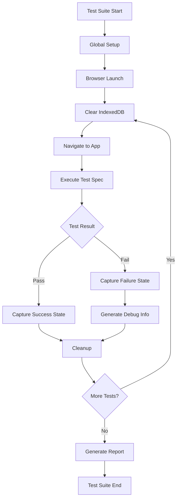

# Design Document: Playwright End-to-End Testing

## Overview

This design document outlines the implementation of a comprehensive Playwright end-to-end testing suite for the Financial Advisor Web Application. The testing framework will validate all core user journeys while respecting the application's privacy-first, local-only architecture. The solution includes test infrastructure, page object models, test data management, and detailed reporting capabilities.

## Architecture

### Testing Framework Structure

```
web/
├── e2e/                           # Playwright test directory
│   ├── tests/                     # Test files organized by feature
│   │   ├── onboarding.spec.ts     # User onboarding flow tests
│   │   ├── portfolio.spec.ts      # Portfolio management tests
│   │   ├── goals.spec.ts          # Goal tracking tests
│   │   ├── profile.spec.ts        # Profile and risk assessment tests
│   │   ├── analysis.spec.ts       # Recommendations and analysis tests
│   │   ├── navigation.spec.ts     # Cross-page navigation tests
│   │   ├── accessibility.spec.ts  # Accessibility compliance tests
│   │   └── responsive.spec.ts     # Responsive design tests
│   ├── page-objects/              # Page Object Model classes
│   │   ├── BasePage.ts           # Base page with common functionality
│   │   ├── OnboardingPage.ts     # Onboarding page interactions
│   │   ├── DashboardPage.ts      # Dashboard page interactions
│   │   ├── PortfolioPage.ts      # Portfolio page interactions
│   │   ├── GoalsPage.ts          # Goals page interactions
│   │   ├── ProfilePage.ts        # Profile page interactions
│   │   └── AnalysisPage.ts       # Analysis page interactions
│   ├── fixtures/                  # Test data and utilities
│   │   ├── test-data.ts          # Sample data for testing
│   │   ├── database-helpers.ts   # IndexedDB test utilities
│   │   └── mock-data.ts          # Mock financial data
│   ├── utils/                     # Test utility functions
│   │   ├── accessibility.ts      # Accessibility testing helpers
│   │   ├── responsive.ts         # Responsive testing utilities
│   │   ├── database.ts           # Database state management
│   │   └── assertions.ts         # Custom assertion helpers
│   └── config/                    # Test configuration
│       ├── playwright.config.ts  # Main Playwright configuration
│       └── test-setup.ts         # Global test setup and teardown
├── playwright-report/             # Generated test reports
└── test-results/                  # Test artifacts and screenshots
```

### Test Execution Flow



## Components and Interfaces

### Page Object Model Design

#### BasePage Class
```typescript
abstract class BasePage {
  protected page: Page
  protected baseUrl: string
  
  constructor(page: Page)
  
  // Navigation methods
  abstract navigate(): Promise<void>
  async waitForLoad(): Promise<void>
  async takeScreenshot(name: string): Promise<void>
  
  // Common interactions
  async clickElement(selector: string): Promise<void>
  async fillInput(selector: string, value: string): Promise<void>
  async selectOption(selector: string, value: string): Promise<void>
  
  // Accessibility helpers
  async checkAccessibility(): Promise<void>
  async validateKeyboardNavigation(): Promise<void>
  
  // Database interactions
  async clearDatabase(): Promise<void>
  async seedDatabase(data: TestData): Promise<void>
  async verifyDatabaseState(expected: Partial<DatabaseState>): Promise<void>
}
```

#### Feature-Specific Page Objects
Each page object will extend BasePage and implement feature-specific interactions:

- **OnboardingPage**: Risk assessment form, profile creation, initial setup
- **DashboardPage**: Portfolio overview, quick actions, navigation
- **PortfolioPage**: Holdings management, add/edit/delete operations
- **GoalsPage**: Goal creation, progress tracking, goal management
- **ProfilePage**: Profile editing, risk tolerance updates
- **AnalysisPage**: Recommendations viewing, analysis tools

### Test Data Management

#### Test Data Structure
```typescript
interface TestData {
  profiles: UserProfile[]
  holdings: Holding[]
  goals: Goal[]
  recommendations: Recommendation[]
  settings: AppSettings
}

interface TestScenario {
  name: string
  description: string
  data: TestData
  expectedOutcomes: ExpectedOutcome[]
}
```

#### Data Seeding Strategy
- **Fresh User**: Empty database state for onboarding tests
- **Experienced User**: Pre-populated with diverse portfolio and goals
- **Risk-Averse User**: Conservative profile with low-risk holdings
- **Aggressive Investor**: High-risk tolerance with growth-focused portfolio
- **Goal-Oriented User**: Multiple financial goals with varying timelines

### Database Testing Integration

#### Database Isolation Strategy
To prevent conflicts between tests and ensure clean state management:

```typescript
class DatabaseTestHelper {
  private testDbName: string
  
  constructor(testId: string) {
    // Create unique database name per test to avoid conflicts
    this.testDbName = `FinancialAdvisorDB_Test_${testId}_${Date.now()}`
  }
  
  async initializeTestDatabase(): Promise<void>
  async clearAllData(): Promise<void>
  async seedTestData(scenario: TestScenario): Promise<void>
  async verifyDataPersistence(): Promise<boolean>
  async validateDataIntegrity(): Promise<ValidationResult>
  async simulateDataCorruption(): Promise<void>
  async testCrossTabConsistency(): Promise<void>
  async cleanupTestDatabase(): Promise<void>
}
```

#### Database Conflict Prevention
- **Unique Database Names**: Each test uses a separate IndexedDB instance
- **Test Isolation**: No shared state between concurrent tests
- **Cleanup Guarantees**: Automatic database cleanup after each test
- **Browser Context Isolation**: Each test runs in isolated browser context
- **Parallel Execution Safety**: Tests can run simultaneously without interference

#### Application Integration Requirements
To support test database isolation, the application's database service needs modification:

```typescript
// Modified database.ts to support test database names
export class FinancialAdvisorDB extends Dexie {
  constructor(dbName?: string) {
    // Use provided database name for tests, default for production
    super(dbName || 'FinancialAdvisorDB')
    // ... rest of constructor
  }
}

// Export factory function for test compatibility
export const createDatabase = (dbName?: string) => new FinancialAdvisorDB(dbName)
export const db = createDatabase() // Default instance
```

#### Privacy Validation
- Network request monitoring to ensure no external calls
- Local storage verification
- IndexedDB isolation testing
- Cross-origin request blocking validation

## Data Models

### Test Configuration Model
```typescript
interface PlaywrightConfig {
  testDir: string
  timeout: number
  retries: number
  workers: number
  reporter: ReporterConfig[]
  use: {
    baseURL: string
    viewport: ViewportSize
    screenshot: 'only-on-failure' | 'on' | 'off'
    video: 'retain-on-failure' | 'on' | 'off'
    trace: 'retain-on-failure' | 'on' | 'off'
  }
  projects: ProjectConfig[]
}

interface ProjectConfig {
  name: string
  use: {
    browserName: 'chromium' | 'firefox' | 'webkit'
    viewport?: ViewportSize
    deviceScaleFactor?: number
  }
}
```

### Test Result Models
```typescript
interface TestResult {
  testName: string
  status: 'passed' | 'failed' | 'skipped'
  duration: number
  error?: Error
  screenshots: string[]
  trace?: string
  accessibility?: AccessibilityResult
}

interface AccessibilityResult {
  violations: AxeViolation[]
  passes: AxePass[]
  incomplete: AxeIncomplete[]
}
```

## Error Handling

### Test Failure Management
- **Automatic Retries**: Configure retry logic for flaky tests
- **Failure Categorization**: Distinguish between application bugs and test issues
- **Debug Information**: Capture comprehensive failure context
- **Recovery Strategies**: Implement test isolation and cleanup

### Error Reporting Strategy
```typescript
class TestErrorHandler {
  async captureFailureState(test: TestInfo): Promise<FailureReport>
  async generateDebugReport(error: Error): Promise<DebugReport>
  async categorizeFailure(error: Error): Promise<FailureCategory>
  async suggestFixes(failure: FailureReport): Promise<string[]>
}
```

### Application Bug Detection
- **UI Regression Detection**: Compare screenshots across test runs
- **Performance Regression**: Monitor page load and interaction times
- **Functionality Validation**: Verify core features work as expected
- **Data Integrity Checks**: Ensure calculations and storage are accurate

## Testing Strategy

### Test Categories and Coverage

#### 1. Smoke Tests (Critical Path)
- Application loads successfully
- Basic navigation works
- Database connection established
- Core features accessible

#### 2. Feature Tests (Comprehensive Coverage)
- **Onboarding Flow**: Complete user setup process
- **Portfolio Management**: CRUD operations for holdings
- **Goal Tracking**: Goal lifecycle management
- **Risk Assessment**: Profile creation and updates
- **Recommendations**: Advice generation and display
- **Data Persistence**: Cross-session data retention

#### 3. Integration Tests (Cross-Feature)
- **Portfolio-Goals Integration**: Goal progress based on portfolio value
- **Profile-Recommendations Integration**: Advice based on risk tolerance
- **Navigation State Management**: Consistent data across pages
- **Real-time Updates**: Changes reflected immediately

#### 4. Accessibility Tests
- **Keyboard Navigation**: All features accessible via keyboard
- **Screen Reader Compatibility**: Proper ARIA labels and structure
- **Color Contrast**: WCAG compliance validation
- **Focus Management**: Logical tab order and focus indicators

#### 5. Responsive Design Tests
- **Mobile Viewport**: Functionality on small screens
- **Tablet Viewport**: Medium screen adaptations
- **Desktop Viewport**: Full-featured desktop experience
- **Touch Interactions**: Mobile-specific interaction patterns

### Test Data Scenarios

#### Scenario 1: New User Journey
```typescript
const newUserScenario: TestScenario = {
  name: "New User Complete Journey",
  description: "First-time user completes full onboarding and setup",
  data: { /* empty database */ },
  expectedOutcomes: [
    "Profile created with risk assessment",
    "Initial portfolio holdings added",
    "Financial goals established",
    "Recommendations generated"
  ]
}
```

#### Scenario 2: Experienced User Management
```typescript
const experiencedUserScenario: TestScenario = {
  name: "Experienced User Portfolio Management",
  description: "Existing user manages complex portfolio",
  data: {
    profiles: [complexUserProfile],
    holdings: [diversifiedPortfolio],
    goals: [multipleGoals]
  },
  expectedOutcomes: [
    "Portfolio rebalancing recommendations",
    "Goal progress tracking accuracy",
    "Performance calculations correctness"
  ]
}
```

### Performance Testing Integration
- **Page Load Times**: Measure and validate loading performance
- **Interaction Response**: Ensure UI responsiveness
- **Database Operations**: Monitor IndexedDB performance
- **Memory Usage**: Detect memory leaks and excessive usage

## Implementation Details

### Playwright Configuration
```typescript
// playwright.config.ts
export default defineConfig({
  testDir: './e2e/tests',
  timeout: 30000,
  retries: process.env.CI ? 2 : 0,
  workers: process.env.CI ? 1 : undefined,
  
  reporter: [
    ['html', { outputFolder: 'playwright-report' }],
    ['json', { outputFile: 'test-results/results.json' }],
    ['junit', { outputFile: 'test-results/junit.xml' }]
  ],
  
  use: {
    baseURL: 'http://localhost:5173/Financial-Adviser-Local-App',
    screenshot: 'only-on-failure',
    video: 'retain-on-failure',
    trace: 'retain-on-failure'
  },
  
  projects: [
    {
      name: 'chromium',
      use: { ...devices['Desktop Chrome'] }
    },
    {
      name: 'firefox',
      use: { ...devices['Desktop Firefox'] }
    },
    {
      name: 'webkit',
      use: { ...devices['Desktop Safari'] }
    },
    {
      name: 'mobile-chrome',
      use: { ...devices['Pixel 5'] }
    },
    {
      name: 'mobile-safari',
      use: { ...devices['iPhone 12'] }
    }
  ],
  
  webServer: {
    command: 'npm run dev',
    port: 5173,
    reuseExistingServer: !process.env.CI
  }
})
```

### Test Execution Strategy
- **Parallel Execution**: Run tests across multiple browsers simultaneously
- **Test Isolation**: Each test starts with clean database state using unique database names
- **Browser Context Isolation**: Each test runs in a separate browser context to prevent data leakage
- **Deterministic Data**: Use consistent test data for reproducible results
- **Environment Consistency**: Ensure tests work in CI/CD and local environments
- **Database Cleanup**: Automatic cleanup of test databases after each test completion
- **State Verification**: Validate clean state before and after each test execution

### Continuous Integration Integration
Integration with existing GitHub Actions workflow (`.github/workflows/deploy.yml`):

- **Extend Existing Test Job**: Add Playwright E2E tests to the current `test` job
- **Sequential Execution**: Run E2E tests after unit tests pass
- **Artifact Publishing**: Upload Playwright HTML reports as GitHub Actions artifacts
- **PR Validation**: E2E tests run on pull requests to validate changes
- **Deployment Gating**: E2E tests must pass before deployment to GitHub Pages
- **No New Workflows**: Integrate into existing workflow to avoid duplication

### Local Development Workflow
- **Watch Mode**: Automatically run tests on code changes
- **Debug Mode**: Step-through debugging with browser DevTools
- **Selective Execution**: Run specific test suites or individual tests
- **Quick Feedback**: Fast test execution for rapid development cycles