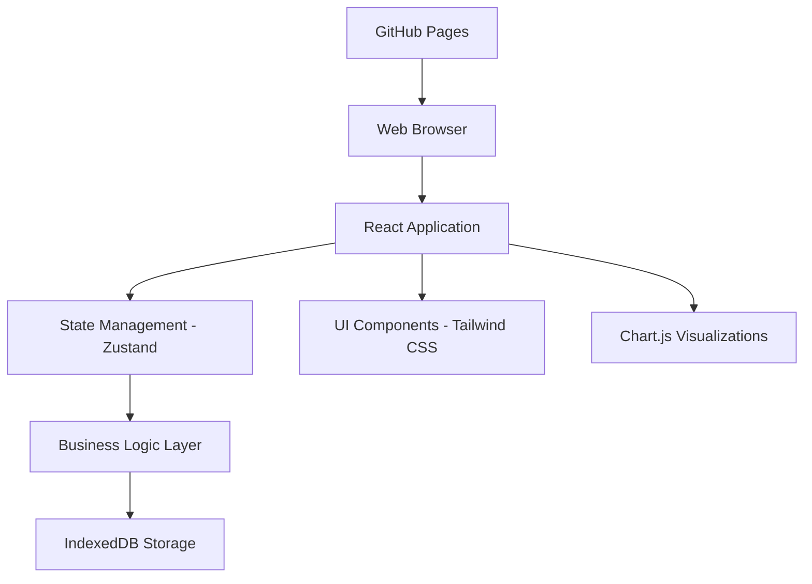

# Design Document

## Overview

The CLI Financial Advisor will be transformed into a modern, client-side web application hosted on GitHub Pages. The application will maintain all existing functionality while providing a clean, responsive user interface that works across devices. All data will be stored locally using IndexedDB, ensuring privacy and eliminating the need for backend infrastructure.

## Architecture

### High-Level Architecture



### Technology Stack

**Frontend Framework:**
- React 18 with TypeScript for type safety and modern development
- Vite for fast development and optimized builds
- Tailwind CSS for responsive, utility-first styling

**State Management:**
- Zustand for lightweight, simple state management
- React Query for data fetching and caching (local IndexedDB operations)

**Data Storage:**
- IndexedDB via Dexie.js for structured local storage
- JSON schema validation using Zod

**Visualization:**
- Chart.js for portfolio charts and analytics
- React Chart.js 2 for React integration
- Lucide React for consistent iconography

**Build & Deployment:**
- Vite for bundling and optimization
- GitHub Actions for CI/CD
- GitHub Pages for hosting

## Components and Interfaces

### Core Components Structure

```
src/
├── components/
│   ├── layout/
│   │   ├── Header.tsx
│   │   ├── Navigation.tsx
│   │   ├── Sidebar.tsx
│   │   └── Layout.tsx
│   ├── portfolio/
│   │   ├── HoldingCard.tsx
│   │   ├── PortfolioSummary.tsx
│   │   ├── AddHoldingForm.tsx
│   │   └── PortfolioChart.tsx
│   ├── profile/
│   │   ├── ProfileForm.tsx
│   │   ├── ProfileSummary.tsx
│   │   └── RiskAssessment.tsx
│   ├── goals/
│   │   ├── GoalCard.tsx
│   │   ├── GoalProgress.tsx
│   │   ├── AddGoalForm.tsx
│   │   └── GoalChart.tsx
│   ├── analysis/
│   │   ├── RecommendationCard.tsx
│   │   ├── RiskMetrics.tsx
│   │   ├── AllocationChart.tsx
│   │   └── PerformanceChart.tsx
│   └── common/
│       ├── Button.tsx
│       ├── Input.tsx
│       ├── Modal.tsx
│       ├── Card.tsx
│       └── LoadingSpinner.tsx
├── pages/
│   ├── Dashboard.tsx
│   ├── Portfolio.tsx
│   ├── Goals.tsx
│   ├── Analysis.tsx
│   ├── Profile.tsx
│   └── Learn.tsx
├── hooks/
│   ├── usePortfolio.ts
│   ├── useProfile.ts
│   ├── useGoals.ts
│   └── useAnalytics.ts
├── services/
│   ├── storage.ts
│   ├── analytics.ts
│   └── recommendations.ts
├── types/
│   ├── portfolio.ts
│   ├── profile.ts
│   ├── goals.ts
│   └── analytics.ts
└── utils/
    ├── calculations.ts
    ├── formatters.ts
    └── validators.ts
```

### Key Interface Definitions

```typescript
// Core data interfaces
interface UserProfile {
  id: string;
  name: string;
  age: number;
  experienceLevel: ExperienceLevel;
  riskTolerance: RiskTolerance;
  timeHorizon: TimeHorizon;
  annualIncome: number;
  investmentGoals: string[];
  createdAt: Date;
  updatedAt: Date;
}

interface Holding {
  id: string;
  symbol: string;
  name: string;
  quantity: number;
  purchasePrice: number;
  currentPrice: number;
  purchaseDate: Date;
  securityType: SecurityType;
  sector?: string;
}

interface Goal {
  id: string;
  name: string;
  category: GoalCategory;
  targetAmount: number;
  currentAmount: number;
  targetDate: Date;
  priority: GoalPriority;
  monthlyContribution: number;
}

interface Recommendation {
  id: string;
  type: RecommendationType;
  priority: RecommendationPriority;
  title: string;
  description: string;
  actionItems: string[];
  impact: string;
}
```

## Data Models

### IndexedDB Schema

```typescript
// Database schema using Dexie
class FinancialAdvisorDB extends Dexie {
  profiles!: Table<UserProfile>;
  holdings!: Table<Holding>;
  goals!: Table<Goal>;
  transactions!: Table<Transaction>;
  settings!: Table<Setting>;

  constructor() {
    super('FinancialAdvisorDB');
    this.version(1).stores({
      profiles: '++id, name, createdAt',
      holdings: '++id, symbol, securityType, purchaseDate',
      goals: '++id, category, targetDate, priority',
      transactions: '++id, holdingId, date, type',
      settings: '++key, value'
    });
  }
}
```


### Data Validation

```typescript
// Zod schemas for runtime validation
const HoldingSchema = z.object({
  id: z.string().uuid(),
  symbol: z.string().min(1).max(10),
  name: z.string().min(1),
  quantity: z.number().positive(),
  purchasePrice: z.number().positive(),
  currentPrice: z.number().positive(),
  purchaseDate: z.date(),
  securityType: z.nativeEnum(SecurityType)
});
```

## Error Handling

### Error Boundary Strategy

```typescript
// Global error boundary for React components
class ErrorBoundary extends Component {
  // Catch and display user-friendly error messages
  // Log errors to browser console for debugging
  // Provide recovery options (refresh, clear data)
}

// Service-level error handling
class StorageError extends Error {
  constructor(message: string, public code: string) {
    super(message);
  }
}

// Error types
enum ErrorCodes {
  STORAGE_QUOTA_EXCEEDED = 'STORAGE_QUOTA_EXCEEDED',
  VALIDATION_FAILED = 'VALIDATION_FAILED',
  NETWORK_ERROR = 'NETWORK_ERROR'
}
```

### User Experience for Errors

- Toast notifications for non-critical errors
- Modal dialogs for critical errors requiring user action
- Graceful degradation when features are unavailable
- Clear error messages with suggested actions

## Testing Strategy

### Unit Testing
- Jest for JavaScript/TypeScript unit tests
- React Testing Library for component testing
- Mock IndexedDB operations using fake-indexeddb
- Test coverage target: 90%+ for business logic

### Integration Testing
- Cypress for end-to-end testing
- Test complete user workflows (setup → add holdings → view analysis)
- Test data persistence across browser sessions
- Test responsive design on different screen sizes

### Performance Testing
- Lighthouse CI for performance monitoring
- Bundle size analysis with webpack-bundle-analyzer
- IndexedDB performance testing with large datasets
- Memory leak detection

### Browser Compatibility Testing
- Automated testing on Chrome, Firefox, Safari, Edge
- Manual testing on mobile browsers
- Progressive enhancement for older browsers
- Graceful fallbacks for unsupported features

## User Interface Design

### Design System

**Color Palette:**
- Primary: Blue (#3B82F6) for financial trust
- Secondary: Green (#10B981) for positive performance
- Warning: Amber (#F59E0B) for alerts
- Error: Red (#EF4444) for negative performance
- Neutral: Gray scale for backgrounds and text

**Typography:**
- Headings: Inter font family, bold weights
- Body: Inter font family, regular weight
- Monospace: JetBrains Mono for financial figures

**Spacing:**
- Consistent 8px grid system
- Generous whitespace for readability
- Card-based layout for content organization

### Responsive Design

```css
/* Mobile-first approach */
.container {
  @apply px-4 mx-auto;
}

/* Tablet */
@media (min-width: 768px) {
  .container {
    @apply px-6 max-w-4xl;
  }
}

/* Desktop */
@media (min-width: 1024px) {
  .container {
    @apply px-8 max-w-6xl;
  }
}
```

### Accessibility

- WCAG 2.1 AA compliance
- Keyboard navigation support
- Screen reader compatibility
- High contrast mode support
- Focus indicators for all interactive elements

## Performance Optimization

### Bundle Optimization
- Code splitting by route and feature
- Tree shaking to eliminate unused code
- Dynamic imports for heavy components
- Service worker for caching static assets

### Runtime Performance
- React.memo for expensive components
- useMemo and useCallback for expensive calculations
- Virtual scrolling for large lists
- Debounced input handling

### Storage Optimization
- Lazy loading of historical data
- Compression of stored data
- Efficient IndexedDB queries with proper indexing
- Cleanup of old/unused data

## Security Considerations

### Client-Side Security
- Input validation and sanitization
- XSS prevention through React's built-in protections
- Content Security Policy headers

### Data Privacy
- No external API calls or data transmission
- Local-only data storage
- User consent for data storage
- Clear data deletion options


## Deployment Strategy

### GitHub Actions Workflow

```yaml
name: Build and Deploy
on:
  push:
    branches: [ main ]
  pull_request:
    branches: [ main ]

jobs:
  test:
    runs-on: ubuntu-latest
    steps:
      - uses: actions/checkout@v3
      - uses: actions/setup-node@v3
      - run: npm ci
      - run: npm run test
      - run: npm run test:e2e

  build-and-deploy:
    needs: test
    runs-on: ubuntu-latest
    if: github.ref == 'refs/heads/main'
    steps:
      - uses: actions/checkout@v3
      - uses: actions/setup-node@v3
      - run: npm ci
      - run: npm run build
      - uses: peaceiris/actions-gh-pages@v3
        with:
          github_token: ${{ secrets.GITHUB_TOKEN }}
          publish_dir: ./dist
```

### Build Configuration

```typescript
// vite.config.ts
export default defineConfig({
  plugins: [react()],
  base: '/cli-financial-advisor/', // GitHub Pages subdirectory
  build: {
    outDir: 'dist',
    sourcemap: true,
    rollupOptions: {
      output: {
        manualChunks: {
          vendor: ['react', 'react-dom'],
          charts: ['chart.js', 'react-chartjs-2'],
          utils: ['date-fns']
        }
      }
    }
  },
  optimizeDeps: {
    include: ['dexie']
  }
});
```

This design provides a comprehensive foundation for transforming the CLI application into a modern web application while maintaining all existing functionality and ensuring excellent user experience.