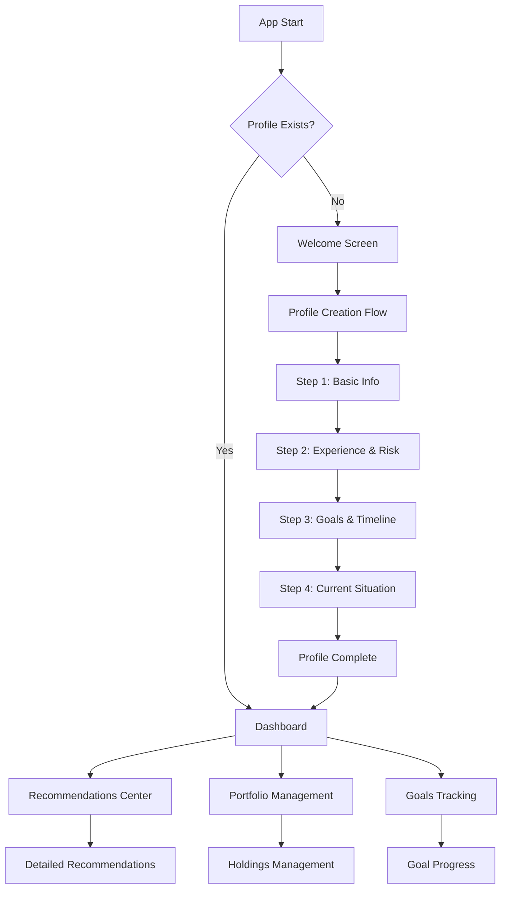

# UX Redesign Design Document

## Overview

This design document outlines a complete UX redesign of the Financial Advisor Web Application to create a smooth, guided user experience that starts with profile creation and focuses on delivering actionable investment recommendations. The redesign addresses broken navigation, implements proper onboarding, and creates a recommendation-driven interface.

## Architecture

### Application Flow Architecture



### State Management Architecture

The application will use a centralized state management approach with Zustand stores:

- **AppStore**: Overall app state, onboarding status, navigation
- **ProfileStore**: User profile data and onboarding progress
- **RecommendationsStore**: Generated recommendations and priority scoring
- **PortfolioStore**: Holdings data and performance calculations
- **GoalsStore**: Financial goals and progress tracking

## Components and Interfaces

### 1. Onboarding System

#### Welcome Screen Component
```typescript
interface WelcomeScreenProps {
  onStartOnboarding: () => void
}
```

**Features:**
- Welcoming hero section explaining the app's value
- Clear call-to-action to start profile creation
- Privacy assurance messaging
- Skip option for returning users (if profile exists)

#### Profile Creation Wizard
```typescript
interface ProfileWizardProps {
  currentStep: number
  totalSteps: number
  onNext: (data: Partial<ProfileData>) => void
  onPrevious: () => void
  onComplete: (profile: CompleteProfileData) => void
}
```

**Step Components:**
1. **BasicInfoStep**: Name, age, income range
2. **ExperienceRiskStep**: Investment experience, risk tolerance assessment
3. **GoalsTimelineStep**: Financial goals, time horizons
4. **CurrentSituationStep**: Existing investments, savings

### 2. Navigation System Redesign

#### Enhanced Layout Component
```typescript
interface LayoutProps {
  children: React.ReactNode
  showNavigation?: boolean
  currentPage?: string
}
```

**Features:**
- React Router Link components instead of anchor tags
- Active state indicators
- Responsive mobile navigation
- Profile completion indicator
- Quick access to recommendations

#### Navigation Guard
```typescript
interface NavigationGuardProps {
  children: React.ReactNode
  requiresProfile?: boolean
}
```

**Features:**
- Redirects to onboarding if profile incomplete
- Preserves intended destination after profile creation
- Loading states during profile checks

### 3. Recommendation-Focused Dashboard

#### Recommendations Center Component
```typescript
interface RecommendationsCenterProps {
  recommendations: Recommendation[]
  onImplement: (recommendationId: string) => void
  onDismiss: (recommendationId: string) => void
}
```

**Features:**
- Priority-based recommendation display
- Action buttons for each recommendation
- Progress tracking for implemented recommendations
- Detailed explanations and rationale

#### Dashboard Layout
```typescript
interface DashboardLayoutProps {
  profile: UserProfile
  recommendations: Recommendation[]
  portfolioSummary: PortfolioSummary
  goalProgress: GoalProgress[]
}
```

**Sections:**
1. **Hero Section**: Personalized greeting and key metrics
2. **Priority Recommendations**: Top 3 actionable recommendations
3. **Portfolio Snapshot**: Quick overview with key metrics
4. **Goal Progress**: Visual progress indicators
5. **Recent Activity**: Latest actions and updates

### 4. Enhanced Portfolio Management

#### Portfolio Integration Component
```typescript
interface PortfolioIntegrationProps {
  holdings: Holding[]
  recommendations: Recommendation[]
  onAddHolding: (holding: NewHolding) => void
  onUpdateHolding: (id: string, updates: Partial<Holding>) => void
}
```

**Features:**
- Recommendation-driven holding suggestions
- Impact analysis for portfolio changes
- Automatic rebalancing suggestions
- Performance tracking with benchmarks

## Data Models

### Enhanced Profile Model
```typescript
interface UserProfile {
  id: string
  personalInfo: {
    name: string
    age: number
    incomeRange: IncomeRange
  }
  investmentProfile: {
    experienceLevel: ExperienceLevel
    riskTolerance: RiskTolerance
    riskScore: number // calculated
  }
  goals: {
    primaryGoals: FinancialGoal[]
    timeHorizon: TimeHorizon
    targetRetirementAge?: number
  }
  currentSituation: {
    existingInvestments: number
    monthlySavings: number
    emergencyFund: number
  }
  preferences: {
    communicationStyle: 'detailed' | 'concise'
    updateFrequency: 'daily' | 'weekly' | 'monthly'
  }
  onboardingCompleted: boolean
  createdAt: Date
  updatedAt: Date
}
```

### Recommendation Model
```typescript
interface Recommendation {
  id: string
  userId: string
  type: RecommendationType
  priority: 'high' | 'medium' | 'low'
  title: string
  description: string
  rationale: string
  actionItems: ActionItem[]
  expectedImpact: {
    riskReduction?: number
    returnImprovement?: number
    goalAcceleration?: number
  }
  implementationDifficulty: 'easy' | 'moderate' | 'complex'
  status: 'pending' | 'in_progress' | 'completed' | 'dismissed'
  createdAt: Date
  updatedAt: Date
}
```

### Onboarding State Model
```typescript
interface OnboardingState {
  currentStep: number
  totalSteps: number
  stepData: Record<string, any>
  isComplete: boolean
  canSkip: boolean
  progress: number // 0-100
}
```

## Error Handling

### Error Boundary Enhancement
- Graceful error recovery with user-friendly messages
- Automatic error reporting for debugging
- Fallback UI components for broken sections
- Profile data recovery mechanisms

### Validation Strategy
- Real-time form validation with helpful error messages
- Progressive validation during onboarding
- Data integrity checks before saving
- Graceful handling of IndexedDB errors

## Testing Strategy

### Component Testing
- Unit tests for all new components using Vitest and Testing Library
- Mock implementations for IndexedDB operations
- Accessibility testing with jest-axe
- Visual regression testing for key components

### Integration Testing
- Complete user journey testing from onboarding to recommendations
- Navigation flow testing across all routes
- State management testing with store interactions
- Form submission and data persistence testing

### End-to-End Testing
- Full onboarding flow testing
- Recommendation generation and interaction testing
- Portfolio management workflow testing
- Cross-browser compatibility testing

### Performance Testing
- Bundle size analysis and optimization
- Loading time measurements
- Memory usage monitoring
- Mobile performance testing

## User Experience Flow

### First-Time User Journey
1. **Landing**: Welcome screen with clear value proposition
2. **Onboarding**: 4-step guided profile creation
3. **Completion**: Profile summary and first recommendations
4. **Dashboard**: Personalized dashboard with actionable recommendations
5. **Exploration**: Guided tour of features and capabilities

### Returning User Journey
1. **Entry**: Direct access to personalized dashboard
2. **Updates**: New recommendations based on profile/portfolio changes
3. **Actions**: Easy implementation of recommended actions
4. **Progress**: Visual feedback on goal progress and improvements

### Mobile Experience
- Touch-friendly interface with appropriate sizing
- Swipe navigation for onboarding steps
- Responsive design for all screen sizes
- Offline capability for core features

## Accessibility Compliance

- WCAG 2.1 AA compliance
- Keyboard navigation support
- Screen reader compatibility
- High contrast mode support
- Focus management for dynamic content
- Alternative text for all visual elements

## Performance Optimization

- Code splitting for onboarding flow
- Lazy loading of non-critical components
- Optimized bundle sizes with tree shaking
- Efficient state updates to prevent unnecessary re-renders
- IndexedDB query optimization
- Image optimization and lazy loading