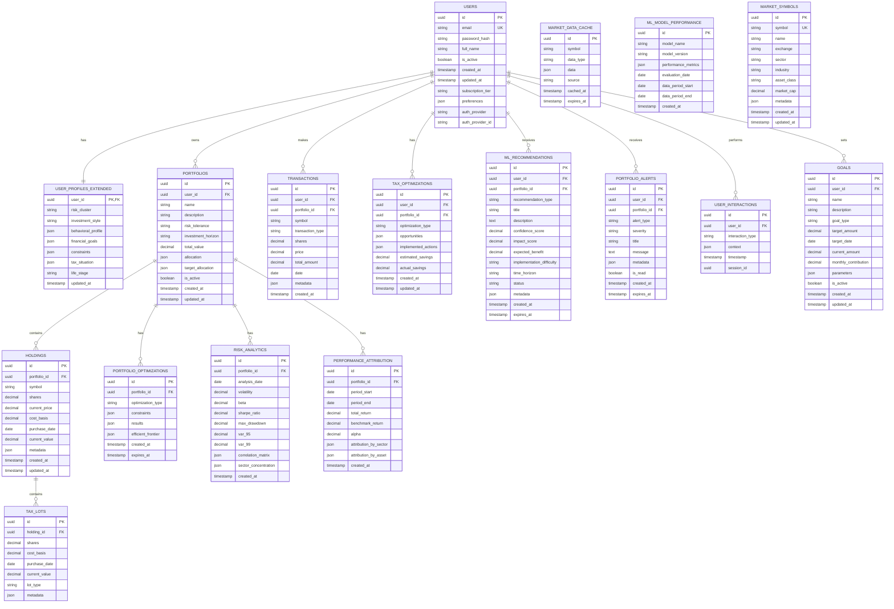

# Technical Implementation Plan - Enhanced Platform

## Executive Summary

This document outlines the technical implementation plan for the enhanced financial adviser application targeting the $200k investor segment. The plan builds upon the MVP foundation while adding sophisticated features, professional-grade performance, and enhanced security measures.

## Technical Architecture Overview

### Enhanced System Architecture
```
┌─────────────────────────────────────────────────────────────────────────────────────┐
│                            Enhanced Financial Adviser Platform                        │
├─────────────────────────────────────────────────────────────────────────────────────┤
│  Frontend (React 18+ with TypeScript)                                                │
│  ├── Advanced Dashboard Components                                                   │
│  ├── Real-time Data Visualization (D3.js/Chart.js)                                   │
│  ├── Professional UI Components (shadcn/ui enhanced)                                 │
│  ├── Mobile-First Responsive Design                                                  │
│  └── PWA Capabilities (Service Workers, Offline Support)                             │
├─────────────────────────────────────────────────────────────────────────────────────┤
│  Backend (FastAPI with Advanced Features)                                            │
│  ├── Portfolio Optimization Engine (SciPy, NumPy)                                    │
│  ├── Real-time Market Data Integration (WebSockets)                                  │
│  ├── Tax Optimization Algorithms                                                     │
│  ├── Risk Analytics Engine                                                           │
│  ├── ML-based Recommendation System                                                  │
│  └── Advanced Security Layer (JWT, AES-256, Rate Limiting)                           │
├─────────────────────────────────────────────────────────────────────────────────────┤
│  Data Layer (Enhanced Database Design)                                               │
│  ├── SQLite (Development) / PostgreSQL (Production)                                  │
│  ├── Advanced Indexing and Query Optimization                                        │
│  ├── Time-series Data Storage (Portfolio History)                                    │
│  ├── Encrypted Configuration Storage                                                 │
│  └── Automated Backup and Recovery                                                   │
├─────────────────────────────────────────────────────────────────────────────────────┤
│  External Integrations                                                               │
│  ├── Market Data APIs (Alpha Vantage, Yahoo Finance, IEX)                            │
│  ├── Economic Data (FRED API)                                                        │
│  ├── News Integration (Financial News APIs)                                          │
│  └── Future: Brokerage APIs (TD Ameritrade, Schwab)                                  │
└─────────────────────────────────────────────────────────────────────────────────────┘
```

### Technology Stack Enhancements

#### Frontend Stack
```typescript
// Enhanced package.json dependencies
{
  "dependencies": {
    // Core React Stack
    "react": "^18.2.0",
    "react-dom": "^18.2.0",
    "typescript": "^5.0.0",
    "vite": "^5.0.0",
    
    // Advanced UI Components
    "@radix-ui/react-*": "^1.0.0",
    "tailwindcss": "^3.3.0",
    "shadcn-ui": "^0.8.0",
    
    // Data Visualization
    "recharts": "^2.8.0",
    "d3": "^7.8.0",
    "@visx/visx": "^3.0.0",
    
    // State Management
    "@tanstack/react-query": "^5.0.0",
    "zustand": "^4.4.0",
    
    // Real-time Features
    "socket.io-client": "^4.7.0",
    "react-use-websocket": "^4.5.0",
    
    // Forms and Validation
    "react-hook-form": "^7.45.0",
    "zod": "^3.22.0",
    
    // PWA Support
    "workbox-webpack-plugin": "^7.0.0",
    "react-app-manifest": "^2.0.0"
  },
  "devDependencies": {
    // Testing
    "@testing-library/react": "^14.0.0",
    "@playwright/test": "^1.40.0",
    "vitest": "^1.0.0",
    
    // Code Quality
    "eslint": "^8.50.0",
    "prettier": "^3.0.0",
    "stylelint": "^15.10.0"
  }
}
```

#### Backend Stack
```python
# Enhanced requirements.txt
fastapi==0.104.1
uvicorn[standard]==0.24.0

# Database and ORM
sqlalchemy==2.0.23
alembic==1.12.1
asyncpg==0.29.0  # PostgreSQL async driver

# Financial Computing
numpy==1.25.2
pandas==2.1.3
scipy==1.11.4
scikit-learn==1.3.2
quantlib==1.32

# Market Data and APIs
aiohttp==3.9.1
websockets==12.0
yfinance==0.2.22
alpha-vantage==2.3.1

# Security
cryptography==41.0.8
python-jose[cryptography]==3.3.0
passlib[bcrypt]==1.7.4
python-multipart==0.0.6

# Background Tasks
celery==5.3.4
redis==5.0.1

# Monitoring and Logging
prometheus-client==0.19.0
structlog==23.2.0

# Development and Testing
pytest==7.4.3
pytest-asyncio==0.21.1
pytest-cov==4.1.0
black==23.11.0
isort==5.12.0
ruff==0.1.6
mypy==1.7.1
```

## Enhanced Feature Implementation

### 1. Advanced Portfolio Optimization Engine

#### Modern Portfolio Theory Implementation
```python
# backend/app/services/portfolio_optimizer.py
import numpy as np
import pandas as pd
from scipy.optimize import minimize
from typing import List, Dict, Tuple, Optional

class PortfolioOptimizer:
    """Advanced portfolio optimization using modern portfolio theory"""
    
    def __init__(self, risk_free_rate: float = 0.02):
        self.risk_free_rate = risk_free_rate
        
    def optimize_portfolio(
        self, 
        assets: List[Asset], 
        constraints: Dict[str, any] = None,
        objective: str = "max_sharpe"
    ) -> OptimizationResult:
        """
        Optimize portfolio allocation using various objectives
        
        Args:
            assets: List of assets with expected returns and volatilities
            constraints: Investment constraints (min/max weights, etc.)
            objective: Optimization objective (max_sharpe, min_volatility, etc.)
        """
        
        # Prepare data
        returns = np.array([asset.expected_return for asset in assets])
        cov_matrix = self.calculate_covariance_matrix(assets)
        
        # Set up constraints
        bounds = self._setup_bounds(assets, constraints)
        constraint_functions = self._setup_constraints(assets, constraints)
        
        # Optimization
        if objective == "max_sharpe":
            result = self._maximize_sharpe_ratio(returns, cov_matrix, bounds, constraint_functions)
        elif objective == "min_volatility":
            result = self._minimize_volatility(returns, cov_matrix, bounds, constraint_functions)
        elif objective == "max_return":
            result = self._maximize_return(returns, cov_matrix, bounds, constraint_functions)
        
        return self._format_result(result, assets)
    
    def efficient_frontier(
        self, 
        assets: List[Asset], 
        num_portfolios: int = 100
    ) -> List[PortfolioPoint]:
        """Generate efficient frontier data points"""
        
        returns = np.array([asset.expected_return for asset in assets])
        cov_matrix = self.calculate_covariance_matrix(assets)
        
        # Generate target returns
        min_return = np.min(returns)
        max_return = np.max(returns)
        target_returns = np.linspace(min_return, max_return, num_portfolios)
        
        efficient_portfolios = []
        for target in target_returns:
            try:
                portfolio = self._optimize_for_target_return(
                    returns, cov_matrix, target
                )
                efficient_portfolios.append(portfolio)
            except Exception as e:
                continue  # Skip infeasible points
                
        return efficient_portfolios
    
    def calculate_covariance_matrix(self, assets: List[Asset]) -> np.ndarray:
        """Calculate covariance matrix from historical data"""
        
        # Fetch historical returns
        historical_data = self._fetch_historical_returns(assets)
        
        # Calculate covariance matrix
        return historical_data.cov().values
    
    def _maximize_sharpe_ratio(
        self, 
        returns: np.ndarray, 
        cov_matrix: np.ndarray, 
        bounds: List[Tuple], 
        constraints: List[Dict]
    ) -> OptimizationResult:
        """Maximize Sharpe ratio optimization"""
        
        num_assets = len(returns)
        
        def objective(weights):
            portfolio_return = np.sum(returns * weights)
            portfolio_vol = np.sqrt(np.dot(weights.T, np.dot(cov_matrix, weights)))
            return -(portfolio_return - self.risk_free_rate) / portfolio_vol
        
        # Initial guess (equal weights)
        initial_guess = np.array([1.0 / num_assets] * num_assets)
        
        # Optimization
        result = minimize(
            objective,
            initial_guess,
            method='SLSQP',
            bounds=bounds,
            constraints=constraints
        )
        
        return result
```

#### Real-time Portfolio Monitoring
```python
# backend/app/services/portfolio_monitor.py
import asyncio
import websockets
import json
from typing import Dict, List
from app.models.portfolio import Portfolio
from app.services.market_data import MarketDataService

class PortfolioMonitor:
    """Real-time portfolio monitoring and alerting"""
    
    def __init__(self):
        self.market_data = MarketDataService()
        self.active_portfolios: Dict[str, Portfolio] = {}
        self.alert_thresholds = {
            'rebalance_drift': 0.05,  # 5% drift threshold
            'loss_limit': 0.10,       # 10% loss threshold
            'gain_target': 0.20       # 20% gain target
        }
    
    async def monitor_portfolio(self, portfolio_id: str):
        """Monitor portfolio for rebalancing and alert conditions"""
        
        portfolio = await self.get_portfolio(portfolio_id)
        self.active_portfolios[portfolio_id] = portfolio
        
        while True:
            try:
                # Update portfolio with current prices
                await self.update_portfolio_prices(portfolio)
                
                # Check for alerts
                alerts = self.check_alerts(portfolio)
                
                # Send alerts if any
                if alerts:
                    await self.send_alerts(portfolio_id, alerts)
                
                # Check rebalancing needs
                rebalance_needed = self.check_rebalancing_needed(portfolio)
                if rebalance_needed:
                    await self.send_rebalancing_recommendation(portfolio_id, rebalance_needed)
                
                # Wait before next check
                await asyncio.sleep(60)  # Check every minute
                
            except Exception as e:
                logger.error(f"Error monitoring portfolio {portfolio_id}: {e}")
                await asyncio.sleep(300)  # Wait 5 minutes on error
    
    def check_alerts(self, portfolio: Portfolio) -> List[Alert]:
        """Check for various alert conditions"""
        
        alerts = []
        
        # Performance alerts
        daily_return = portfolio.calculate_daily_return()
        if daily_return < -self.alert_thresholds['loss_limit']:
            alerts.append(Alert(
                type="performance_alert",
                severity="high",
                message=f"Portfolio down {daily_return:.2%} today",
                recommended_action="Review holdings and consider risk management"
            ))
        
        # Volatility alerts
        volatility = portfolio.calculate_rolling_volatility(days=30)
        if volatility > portfolio.target_volatility * 1.5:
            alerts.append(Alert(
                type="volatility_alert",
                severity="medium",
                message=f"Portfolio volatility elevated: {volatility:.2%}",
                recommended_action="Consider reducing risk exposure"
            ))
        
        # Dividend alerts
        upcoming_dividends = portfolio.get_upcoming_dividends()
        if upcoming_dividends:
            alerts.append(Alert(
                type="dividend_alert",
                severity="low",
                message=f"Upcoming dividends: ${upcoming_dividends:.2f}",
                recommended_action="Consider tax implications and reinvestment"
            ))
        
        return alerts
```

### 2. Real-time Market Data Integration

#### WebSocket Market Data Service
```python
# backend/app/services/market_data.py
import asyncio
import websockets
import json
from typing import Dict, List, Optional
from app.core.config import settings

class MarketDataService:
    """Real-time market data service with multiple providers"""
    
    def __init__(self):
        self.connections: Dict[str, websockets.WebSocketServerProtocol] = {}
        self.subscriptions: Dict[str, List[str]] = {}  # symbol -> [client_ids]
        self.price_cache: Dict[str, PriceData] = {}
        self.providers = [
            AlphaVantageProvider(api_key=settings.ALPHA_VANTAGE_API_KEY),
            YahooFinanceProvider(),
            IEXCloudProvider(api_key=settings.IEX_API_KEY)
        ]
    
    async def start_market_data_stream(self):
        """Start the real-time market data stream"""
        
        # Start WebSocket server for client connections
        server = await websockets.serve(
            self.handle_client_connection,
            "localhost",
            8765
        )
        
        # Start market data feeds
        await asyncio.gather(
            self.start_price_feeds(),
            self.start_news_feeds(),
            self.start_economic_data_feeds()
        )
        
        await server.wait_closed()
    
    async def handle_client_connection(self, websocket, path):
        """Handle new client WebSocket connections"""
        
        client_id = str(id(websocket))
        self.connections[client_id] = websocket
        
        try:
            await websocket.send(json.dumps({
                "type": "connection_established",
                "client_id": client_id
            }))
            
            async for message in websocket:
                data = json.loads(message)
                await self.handle_client_message(client_id, data)
                
        except websockets.exceptions.ConnectionClosed:
            pass
        finally:
            # Clean up client
            if client_id in self.connections:
                del self.connections[client_id]
            self.cleanup_client_subscriptions(client_id)
    
    async def handle_client_message(self, client_id: str, data: Dict):
        """Handle messages from clients"""
        
        if data["type"] == "subscribe":
            symbols = data.get("symbols", [])
            await self.subscribe_client(client_id, symbols)
            
        elif data["type"] == "unsubscribe":
            symbols = data.get("symbols", [])
            await self.unsubscribe_client(client_id, symbols)
            
        elif data["type"] == "get_historical":
            symbol = data.get("symbol")
            period = data.get("period", "1y")
            historical_data = await self.get_historical_data(symbol, period)
            await self.send_to_client(client_id, {
                "type": "historical_data",
                "symbol": symbol,
                "data": historical_data
            })
    
    async def start_price_feeds(self):
        """Start real-time price feeds from multiple providers"""
        
        while True:
            try:
                # Get all subscribed symbols
                all_symbols = set()
                for symbols in self.subscriptions.values():
                    all_symbols.update(symbols)
                
                if not all_symbols:
                    await asyncio.sleep(10)
                    continue
                
                # Fetch prices from providers
                price_updates = await self.fetch_price_updates(list(all_symbols))
                
                # Update cache and broadcast to clients
                for symbol, price_data in price_updates.items():
                    self.price_cache[symbol] = price_data
                    await self.broadcast_price_update(symbol, price_data)
                
                await asyncio.sleep(1)  # Update every second
                
            except Exception as e:
                logger.error(f"Error in price feed: {e}")
                await asyncio.sleep(5)
    
    async def fetch_price_updates(self, symbols: List[str]) -> Dict[str, PriceData]:
        """Fetch price updates from multiple providers with failover"""
        
        price_updates = {}
        
        for provider in self.providers:
            try:
                updates = await provider.get_real_time_prices(symbols)
                price_updates.update(updates)
                
                # If we got all symbols, break
                if len(price_updates) == len(symbols):
                    break
                    
            except Exception as e:
                logger.warning(f"Provider {provider.name} failed: {e}")
                continue
        
        return price_updates
```

### 3. Advanced Tax Optimization

#### Tax-Loss Harvesting Engine
```python
# backend/app/services/tax_optimizer.py
import pandas as pd
import numpy as np
from datetime import datetime, timedelta
from typing import List, Dict, Tuple, Optional
from app.models.holding import Holding
from app.models.transaction import Transaction

class TaxOptimizer:
    """Advanced tax optimization and loss harvesting"""
    
    def __init__(self):
        self.wash_sale_period = timedelta(days=30)
        self.short_term_threshold = timedelta(days=365)
    
    def identify_tax_loss_opportunities(
        self, 
        holdings: List[Holding],
        transactions: List[Transaction]
    ) -> List[TaxLossOpportunity]:
        """Identify tax-loss harvesting opportunities"""
        
        opportunities = []
        
        for holding in holdings:
            # Calculate unrealized loss
            unrealized_loss = holding.calculate_unrealized_loss()
            
            if unrealized_loss > 0:  # Only losses
                # Check wash sale risk
                wash_sale_risk = self.assess_wash_sale_risk(
                    holding, transactions
                )
                
                # Find replacement securities
                replacement_options = self.find_replacement_securities(holding)
                
                # Calculate tax savings
                tax_savings = self.calculate_tax_savings(holding, unrealized_loss)
                
                opportunity = TaxLossOpportunity(
                    holding=holding,
                    unrealized_loss=unrealized_loss,
                    tax_savings=tax_savings,
                    wash_sale_risk=wash_sale_risk,
                    replacement_options=replacement_options,
                    recommended_action=self.get_recommended_action(
                        unrealized_loss, wash_sale_risk, tax_savings
                    )
                )
                
                opportunities.append(opportunity)
        
        # Sort by potential tax savings
        opportunities.sort(key=lambda x: x.tax_savings, reverse=True)
        
        return opportunities
    
    def assess_wash_sale_risk(
        self, 
        holding: Holding, 
        transactions: List[Transaction]
    ) -> WashSaleRisk:
        """Assess wash sale risk for a holding"""
        
        symbol = holding.symbol
        current_date = datetime.now()
        
        # Check recent purchases
        recent_purchases = [
            tx for tx in transactions
            if (tx.symbol == symbol and 
                tx.transaction_type == "BUY" and
                (current_date - tx.date) <= self.wash_sale_period)
        ]
        
        # Check planned future purchases (from recurring investments)
        future_purchases = self.check_future_purchases(symbol, current_date)
        
        if recent_purchases or future_purchases:
            return WashSaleRisk(
                risk_level="HIGH",
                recent_purchases=recent_purchases,
                future_purchases=future_purchases,
                recommendation="Wait 31 days or modify recurring investments"
            )
        
        return WashSaleRisk(
            risk_level="LOW",
            recent_purchases=[],
            future_purchases=[],
            recommendation="Safe to harvest loss"
        )
    
    def find_replacement_securities(self, holding: Holding) -> List[ReplacementOption]:
        """Find suitable replacement securities to maintain exposure"""
        
        # Get asset class and sector information
        asset_info = self.get_asset_information(holding.symbol)
        
        # Find similar assets
        similar_assets = self.find_similar_assets(asset_info)
        
        replacement_options = []
        for asset in similar_assets:
            # Calculate correlation
            correlation = self.calculate_correlation(holding.symbol, asset.symbol)
            
            # Check if substantially identical (wash sale rule)
            substantially_identical = self.is_substantially_identical(
                holding.symbol, asset.symbol
            )
            
            if not substantially_identical and correlation > 0.8:
                replacement_options.append(ReplacementOption(
                    symbol=asset.symbol,
                    name=asset.name,
                    correlation=correlation,
                    expense_ratio=asset.expense_ratio,
                    tracking_difference=asset.tracking_difference,
                    suitability_score=self.calculate_suitability_score(
                        holding, asset
                    )
                ))
        
        # Sort by suitability score
        replacement_options.sort(key=lambda x: x.suitability_score, reverse=True)
        
        return replacement_options[:5]  # Return top 5 options
    
    def optimize_asset_location(
        self, 
        accounts: List[Account],
        target_allocation: Dict[str, float]
    ) -> AssetLocationPlan:
        """Optimize asset location across account types for tax efficiency"""
        
        # Categorize accounts by tax treatment
        taxable_accounts = [acc for acc in accounts if acc.type == "TAXABLE"]
        tax_deferred_accounts = [acc for acc in accounts if acc.type == "TRADITIONAL_IRA"]
        tax_free_accounts = [acc for acc in accounts if acc.type == "ROTH_IRA"]
        
        # Asset tax efficiency ranking
        asset_tax_efficiency = self.rank_assets_by_tax_efficiency(
            list(target_allocation.keys())
        )
        
        # Optimization algorithm
        placement_plan = self.optimize_placement(
            asset_tax_efficiency,
            target_allocation,
            taxable_accounts,
            tax_deferred_accounts,
            tax_free_accounts
        )
        
        return placement_plan
```

### 4. Machine Learning Recommendation System

#### Personalized Investment Recommendations
```python
# backend/app/services/recommendation_engine.py
import pandas as pd
import numpy as np
from sklearn.ensemble import RandomForestRegressor
from sklearn.cluster import KMeans
from sklearn.preprocessing import StandardScaler
from typing import List, Dict, Tuple
from app.models.user import User
from app.models.portfolio import Portfolio

class RecommendationEngine:
    """ML-powered personalized investment recommendations"""
    
    def __init__(self):
        self.user_clustering_model = None
        self.performance_prediction_model = None
        self.risk_assessment_model = None
        self.scaler = StandardScaler()
    
    def train_models(self, historical_data: pd.DataFrame):
        """Train ML models on historical user data"""
        
        # User clustering model
        user_features = self.extract_user_features(historical_data)
        self.user_clustering_model = KMeans(n_clusters=5, random_state=42)
        self.user_clustering_model.fit(user_features)
        
        # Performance prediction model
        performance_features = self.extract_performance_features(historical_data)
        performance_targets = historical_data['future_returns']
        
        self.performance_prediction_model = RandomForestRegressor(
            n_estimators=100, random_state=42
        )
        self.performance_prediction_model.fit(performance_features, performance_targets)
        
        # Risk assessment model
        risk_features = self.extract_risk_features(historical_data)
        risk_targets = historical_data['realized_volatility']
        
        self.risk_assessment_model = RandomForestRegressor(
            n_estimators=100, random_state=42
        )
        self.risk_assessment_model.fit(risk_features, risk_targets)
    
    def generate_recommendations(
        self, 
        user: User, 
        portfolio: Portfolio
    ) -> List[Recommendation]:
        """Generate personalized investment recommendations"""
        
        # User clustering
        user_features = self.extract_user_features_single(user)
        user_cluster = self.user_clustering_model.predict([user_features])[0]
        
        # Portfolio analysis
        portfolio_analysis = self.analyze_portfolio(portfolio)
        
        # Generate recommendations based on cluster and analysis
        recommendations = []
        
        # Asset allocation recommendations
        allocation_recs = self.generate_allocation_recommendations(
            user, portfolio, user_cluster
        )
        recommendations.extend(allocation_recs)
        
        # Individual security recommendations
        security_recs = self.generate_security_recommendations(
            user, portfolio, user_cluster
        )
        recommendations.extend(security_recs)
        
        # Tax optimization recommendations
        tax_recs = self.generate_tax_recommendations(user, portfolio)
        recommendations.extend(tax_recs)
        
        # Goal-based recommendations
        goal_recs = self.generate_goal_recommendations(user, portfolio)
        recommendations.extend(goal_recs)
        
        # Sort by impact score
        recommendations.sort(key=lambda x: x.impact_score, reverse=True)
        
        return recommendations
    
    def generate_allocation_recommendations(
        self, 
        user: User, 
        portfolio: Portfolio, 
        user_cluster: int
    ) -> List[Recommendation]:
        """Generate asset allocation recommendations"""
        
        recommendations = []
        
        # Get current allocation
        current_allocation = portfolio.get_asset_allocation()
        
        # Get target allocation for user cluster
        target_allocation = self.get_target_allocation_for_cluster(
            user_cluster, user.age, user.risk_tolerance
        )
        
        # Find allocation gaps
        for asset_class, target_weight in target_allocation.items():
            current_weight = current_allocation.get(asset_class, 0.0)
            drift = abs(current_weight - target_weight)
            
            if drift > 0.05:  # 5% threshold
                recommendations.append(Recommendation(
                    type="allocation_adjustment",
                    title=f"Adjust {asset_class} allocation",
                    description=f"Current: {current_weight:.1%}, Target: {target_weight:.1%}",
                    impact_score=drift * 100,
                    confidence_score=0.8,
                    expected_benefit=self.calculate_allocation_benefit(
                        current_weight, target_weight, portfolio.value
                    ),
                    implementation_difficulty="MEDIUM",
                    time_horizon="IMMEDIATE"
                ))
        
        return recommendations
    
    def generate_security_recommendations(
        self, 
        user: User, 
        portfolio: Portfolio, 
        user_cluster: int
    ) -> List[Recommendation]:
        """Generate individual security recommendations"""
        
        recommendations = []
        
        # Analyze current holdings
        for holding in portfolio.holdings:
            # Performance prediction
            predicted_return = self.predict_security_performance(holding)
            
            # Risk assessment
            predicted_risk = self.assess_security_risk(holding)
            
            # Peer comparison
            peer_comparison = self.compare_to_peers(holding, user_cluster)
            
            # Generate recommendation if needed
            if peer_comparison.score < 0.3:  # Low peer score
                recommendations.append(Recommendation(
                    type="security_replacement",
                    title=f"Consider replacing {holding.symbol}",
                    description=f"Underperforming vs peers: {peer_comparison.reason}",
                    impact_score=peer_comparison.potential_improvement * 100,
                    confidence_score=peer_comparison.confidence,
                    expected_benefit=peer_comparison.expected_benefit,
                    implementation_difficulty="EASY",
                    time_horizon="SHORT_TERM",
                    replacement_suggestions=peer_comparison.alternatives
                ))
        
        return recommendations
```

### 5. Enhanced Security Implementation

#### Advanced Authentication and Authorization
```python
# backend/app/security/advanced_auth.py
import jwt
import bcrypt
from datetime import datetime, timedelta
from cryptography.fernet import Fernet
from typing import Optional, Dict
from app.core.config import settings

class AdvancedAuthManager:
    """Advanced authentication with multiple security layers"""
    
    def __init__(self):
        self.jwt_secret = settings.JWT_SECRET_KEY
        self.encryption_key = Fernet.generate_key()
        self.cipher_suite = Fernet(self.encryption_key)
        self.failed_attempts: Dict[str, int] = {}
        self.lockout_duration = timedelta(minutes=15)
    
    def authenticate_user(
        self, 
        email: str, 
        password: str, 
        ip_address: str,
        user_agent: str
    ) -> Optional[AuthResult]:
        """Authenticate user with advanced security checks"""
        
        # Check for account lockout
        if self.is_account_locked(email):
            return AuthResult(
                success=False,
                error="Account temporarily locked due to failed attempts",
                lockout_until=self.get_lockout_expiry(email)
            )
        
        # Rate limiting check
        if self.is_rate_limited(ip_address):
            return AuthResult(
                success=False,
                error="Too many authentication attempts from this IP",
                rate_limit_reset=self.get_rate_limit_reset(ip_address)
            )
        
        # Get user from database
        user = self.get_user_by_email(email)
        if not user:
            self.record_failed_attempt(email, ip_address)
            return AuthResult(success=False, error="Invalid credentials")
        
        # Verify password
        if not self.verify_password(password, user.password_hash):
            self.record_failed_attempt(email, ip_address)
            return AuthResult(success=False, error="Invalid credentials")
        
        # Check for suspicious activity
        if self.detect_suspicious_activity(user, ip_address, user_agent):
            return AuthResult(
                success=False,
                error="Unusual activity detected. Please verify your identity.",
                requires_additional_verification=True
            )
        
        # Generate secure session
        session_token = self.generate_session_token(user)
        refresh_token = self.generate_refresh_token(user)
        
        # Log successful authentication
        self.log_authentication(user, ip_address, user_agent, success=True)
        
        # Reset failed attempts
        self.reset_failed_attempts(email)
        
        return AuthResult(
            success=True,
            user=user,
            session_token=session_token,
            refresh_token=refresh_token,
            expires_at=datetime.utcnow() + timedelta(hours=1)
        )
    
    def generate_session_token(self, user: User) -> str:
        """Generate secure JWT session token"""
        
        payload = {
            'user_id': str(user.id),
            'email': user.email,
            'exp': datetime.utcnow() + timedelta(hours=1),
            'iat': datetime.utcnow(),
            'jti': self.generate_unique_token_id(),
            'permissions': user.get_permissions()
        }
        
        return jwt.encode(payload, self.jwt_secret, algorithm='HS256')
    
    def encrypt_sensitive_data(self, data: str) -> str:
        """Encrypt sensitive data using AES-256"""
        return self.cipher_suite.encrypt(data.encode()).decode()
    
    def decrypt_sensitive_data(self, encrypted_data: str) -> str:
        """Decrypt sensitive data"""
        return self.cipher_suite.decrypt(encrypted_data.encode()).decode()
    
    def detect_suspicious_activity(
        self, 
        user: User, 
        ip_address: str, 
        user_agent: str
    ) -> bool:
        """Detect suspicious authentication patterns"""
        
        # Check for unusual IP address
        if not self.is_known_ip(user, ip_address):
            return True
        
        # Check for unusual user agent
        if not self.is_known_user_agent(user, user_agent):
            return True
        
        # Check for unusual time patterns
        if self.is_unusual_time(user):
            return True
        
        # Check for concurrent sessions
        if self.has_concurrent_sessions(user):
            return True
        
        return False
```

## Implementation Timeline

### Phase 1: Core Enhancements (Months 1-3)
- **Month 1**: Advanced portfolio optimization engine
- **Month 2**: Real-time market data integration
- **Month 3**: Enhanced UI components and visualization

### Phase 2: Advanced Features (Months 4-6)
- **Month 4**: Tax optimization algorithms
- **Month 5**: Machine learning recommendation system
- **Month 6**: Advanced security implementation

### Phase 3: Professional Features (Months 7-9)
- **Month 7**: Professional reporting and analytics
- **Month 8**: Mobile app optimization
- **Month 9**: Performance optimization and testing

## Performance Optimization

### Backend Performance
- **Database Optimization**: Query optimization, indexing, connection pooling
- **Caching Strategy**: Redis for market data, computation results
- **Async Processing**: Background tasks for heavy computations
- **Load Balancing**: Horizontal scaling preparation

### Frontend Performance
- **Code Splitting**: Dynamic imports for better loading
- **Lazy Loading**: Component and data lazy loading
- **Memoization**: React.memo and useMemo optimization
- **Virtual Scrolling**: For large data sets

## Security Enhancements

### Data Protection
- **End-to-End Encryption**: All sensitive data encrypted
- **Key Management**: Secure key storage and rotation
- **Audit Logging**: Comprehensive activity logging
- **Access Controls**: Role-based access control

### Infrastructure Security
- **Network Security**: VPN, firewall configuration
- **Container Security**: Docker security best practices
- **Monitoring**: Real-time security monitoring
- **Backup Security**: Encrypted backups with testing

## Quality Assurance

### Testing Strategy
- **Unit Testing**: 85%+ code coverage
- **Integration Testing**: API and database testing
- **End-to-End Testing**: Critical user flow testing
- **Performance Testing**: Load and stress testing

### Monitoring and Alerting
- **Application Monitoring**: Performance metrics
- **Error Tracking**: Comprehensive error logging
- **User Analytics**: Usage patterns and optimization
- **Security Monitoring**: Threat detection and response

## Complete Database Schema Design

### Enhanced Entity Relationship Diagram



### Advanced Database Schema Implementation

```sql
-- Enhanced users table with additional fields
CREATE TABLE users (
    id UUID PRIMARY KEY DEFAULT gen_random_uuid(),
    email VARCHAR(255) UNIQUE NOT NULL,
    password_hash VARCHAR(255) NOT NULL,
    full_name VARCHAR(255) NOT NULL,
    is_active BOOLEAN DEFAULT TRUE,
    created_at TIMESTAMP WITH TIME ZONE DEFAULT NOW(),
    updated_at TIMESTAMP WITH TIME ZONE DEFAULT NOW(),
    subscription_tier VARCHAR(20) DEFAULT 'basic',
    preferences JSONB DEFAULT '{}',
    auth_provider VARCHAR(50) DEFAULT 'local',
    auth_provider_id VARCHAR(255),
    last_login TIMESTAMP WITH TIME ZONE,
    login_count INTEGER DEFAULT 0,
    failed_login_attempts INTEGER DEFAULT 0,
    locked_until TIMESTAMP WITH TIME ZONE,
    email_verified BOOLEAN DEFAULT FALSE,
    email_verification_token VARCHAR(255),
    password_reset_token VARCHAR(255),
    password_reset_expires TIMESTAMP WITH TIME ZONE
);

-- Enhanced portfolios table with advanced features
CREATE TABLE portfolios (
    id UUID PRIMARY KEY DEFAULT gen_random_uuid(),
    user_id UUID NOT NULL REFERENCES users(id) ON DELETE CASCADE,
    name VARCHAR(255) NOT NULL,
    description TEXT,
    risk_tolerance VARCHAR(20) DEFAULT 'moderate',
    investment_horizon VARCHAR(20) DEFAULT 'long_term',
    total_value DECIMAL(15,2) DEFAULT 0.00,
    allocation JSONB DEFAULT '{}',
    target_allocation JSONB DEFAULT '{}',
    is_active BOOLEAN DEFAULT TRUE,
    created_at TIMESTAMP WITH TIME ZONE DEFAULT NOW(),
    updated_at TIMESTAMP WITH TIME ZONE DEFAULT NOW(),
    last_rebalanced TIMESTAMP WITH TIME ZONE,
    rebalance_threshold DECIMAL(5,4) DEFAULT 0.05,
    benchmark_symbol VARCHAR(10) DEFAULT 'SPY',
    currency VARCHAR(3) DEFAULT 'USD',
    portfolio_type VARCHAR(20) DEFAULT 'investment',
    tags JSONB DEFAULT '[]',
    notes TEXT
);

-- Enhanced holdings table with detailed tracking
CREATE TABLE holdings (
    id UUID PRIMARY KEY DEFAULT gen_random_uuid(),
    portfolio_id UUID NOT NULL REFERENCES portfolios(id) ON DELETE CASCADE,
    symbol VARCHAR(10) NOT NULL,
    shares DECIMAL(15,6) NOT NULL,
    current_price DECIMAL(10,4),
    cost_basis DECIMAL(15,2),
    purchase_date DATE,
    current_value DECIMAL(15,2),
    unrealized_gain_loss DECIMAL(15,2),
    day_change DECIMAL(15,2),
    day_change_percent DECIMAL(8,4),
    allocation_percent DECIMAL(8,4),
    metadata JSONB DEFAULT '{}',
    created_at TIMESTAMP WITH TIME ZONE DEFAULT NOW(),
    updated_at TIMESTAMP WITH TIME ZONE DEFAULT NOW(),
    last_price_update TIMESTAMP WITH TIME ZONE,
    dividend_yield DECIMAL(8,4),
    ex_dividend_date DATE,
    sector VARCHAR(50),
    industry VARCHAR(100),
    asset_class VARCHAR(50),
    country VARCHAR(50),
    currency VARCHAR(3) DEFAULT 'USD'
);

-- Tax lots for detailed tax tracking
CREATE TABLE tax_lots (
    id UUID PRIMARY KEY DEFAULT gen_random_uuid(),
    holding_id UUID NOT NULL REFERENCES holdings(id) ON DELETE CASCADE,
    shares DECIMAL(15,6) NOT NULL,
    cost_basis DECIMAL(15,2) NOT NULL,
    purchase_date DATE NOT NULL,
    current_value DECIMAL(15,2),
    lot_type VARCHAR(20) DEFAULT 'fifo',
    acquisition_method VARCHAR(20) DEFAULT 'purchase',
    metadata JSONB DEFAULT '{}',
    created_at TIMESTAMP WITH TIME ZONE DEFAULT NOW(),
    updated_at TIMESTAMP WITH TIME ZONE DEFAULT NOW(),
    wash_sale_disallowed BOOLEAN DEFAULT FALSE,
    wash_sale_amount DECIMAL(15,2) DEFAULT 0.00,
    holding_period_type VARCHAR(20) -- 'short_term', 'long_term'
);

-- Enhanced transactions table
CREATE TABLE transactions (
    id UUID PRIMARY KEY DEFAULT gen_random_uuid(),
    user_id UUID NOT NULL REFERENCES users(id) ON DELETE CASCADE,
    portfolio_id UUID NOT NULL REFERENCES portfolios(id) ON DELETE CASCADE,
    symbol VARCHAR(10) NOT NULL,
    transaction_type VARCHAR(20) NOT NULL,
    shares DECIMAL(15,6) NOT NULL,
    price DECIMAL(10,4) NOT NULL,
    total_amount DECIMAL(15,2) NOT NULL,
    fees DECIMAL(10,2) DEFAULT 0.00,
    date DATE NOT NULL,
    settlement_date DATE,
    metadata JSONB DEFAULT '{}',
    created_at TIMESTAMP WITH TIME ZONE DEFAULT NOW(),
    account_type VARCHAR(20),
    tax_lot_id UUID REFERENCES tax_lots(id),
    broker VARCHAR(50),
    order_id VARCHAR(100),
    execution_venue VARCHAR(50),
    is_reinvestment BOOLEAN DEFAULT FALSE,
    parent_transaction_id UUID REFERENCES transactions(id)
);

-- Goals table for financial planning
CREATE TABLE goals (
    id UUID PRIMARY KEY DEFAULT gen_random_uuid(),
    user_id UUID NOT NULL REFERENCES users(id) ON DELETE CASCADE,
    name VARCHAR(255) NOT NULL,
    description TEXT,
    goal_type VARCHAR(50) NOT NULL,
    target_amount DECIMAL(15,2) NOT NULL,
    target_date DATE NOT NULL,
    current_amount DECIMAL(15,2) DEFAULT 0.00,
    monthly_contribution DECIMAL(15,2) DEFAULT 0.00,
    parameters JSONB DEFAULT '{}',
    is_active BOOLEAN DEFAULT TRUE,
    created_at TIMESTAMP WITH TIME ZONE DEFAULT NOW(),
    updated_at TIMESTAMP WITH TIME ZONE DEFAULT NOW(),
    priority INTEGER DEFAULT 1,
    progress_percent DECIMAL(5,2) DEFAULT 0.00,
    projected_completion_date DATE,
    risk_tolerance VARCHAR(20) DEFAULT 'moderate',
    linked_portfolio_id UUID REFERENCES portfolios(id),
    tags JSONB DEFAULT '[]'
);

-- Market symbols reference table
CREATE TABLE market_symbols (
    id UUID PRIMARY KEY DEFAULT gen_random_uuid(),
    symbol VARCHAR(10) UNIQUE NOT NULL,
    name VARCHAR(255) NOT NULL,
    exchange VARCHAR(10) NOT NULL,
    sector VARCHAR(50),
    industry VARCHAR(100),
    asset_class VARCHAR(50) NOT NULL,
    market_cap DECIMAL(15,0),
    metadata JSONB DEFAULT '{}',
    created_at TIMESTAMP WITH TIME ZONE DEFAULT NOW(),
    updated_at TIMESTAMP WITH TIME ZONE DEFAULT NOW(),
    is_active BOOLEAN DEFAULT TRUE,
    country VARCHAR(50),
    currency VARCHAR(3) DEFAULT 'USD',
    isin VARCHAR(12),
    cusip VARCHAR(9),
    expense_ratio DECIMAL(6,4),
    dividend_yield DECIMAL(8,4),
    beta DECIMAL(8,4),
    pe_ratio DECIMAL(8,2),
    market_cap_category VARCHAR(20),
    morningstar_category VARCHAR(50)
);

-- Enhanced indexes for performance
CREATE INDEX idx_portfolios_user_id ON portfolios(user_id);
CREATE INDEX idx_portfolios_created_at ON portfolios(created_at);
CREATE INDEX idx_holdings_portfolio_id ON holdings(portfolio_id);
CREATE INDEX idx_holdings_symbol ON holdings(symbol);
CREATE INDEX idx_holdings_updated_at ON holdings(updated_at);
CREATE INDEX idx_tax_lots_holding_id ON tax_lots(holding_id);
CREATE INDEX idx_tax_lots_purchase_date ON tax_lots(purchase_date);
CREATE INDEX idx_transactions_user_id ON transactions(user_id);
CREATE INDEX idx_transactions_portfolio_id ON transactions(portfolio_id);
CREATE INDEX idx_transactions_symbol ON transactions(symbol);
CREATE INDEX idx_transactions_date ON transactions(date);
CREATE INDEX idx_goals_user_id ON goals(user_id);
CREATE INDEX idx_goals_target_date ON goals(target_date);
CREATE INDEX idx_market_symbols_symbol ON market_symbols(symbol);
CREATE INDEX idx_market_symbols_sector ON market_symbols(sector);
CREATE INDEX idx_market_symbols_asset_class ON market_symbols(asset_class);

-- Full-text search indexes
CREATE INDEX idx_portfolios_name_fts ON portfolios USING gin(to_tsvector('english', name));
CREATE INDEX idx_market_symbols_name_fts ON market_symbols USING gin(to_tsvector('english', name));
CREATE INDEX idx_goals_name_fts ON goals USING gin(to_tsvector('english', name));
```

## Complete API Design Specification

### RESTful API Endpoints

#### Authentication & User Management
```yaml
# Authentication endpoints
POST /api/v1/auth/register
POST /api/v1/auth/login
POST /api/v1/auth/logout
POST /api/v1/auth/refresh
POST /api/v1/auth/forgot-password
POST /api/v1/auth/reset-password
POST /api/v1/auth/verify-email
POST /api/v1/auth/change-password

# User profile endpoints
GET /api/v1/users/profile
PUT /api/v1/users/profile
GET /api/v1/users/preferences
PUT /api/v1/users/preferences
DELETE /api/v1/users/account
POST /api/v1/users/export-data
```

#### Portfolio Management
```yaml
# Portfolio CRUD
GET /api/v1/portfolios
POST /api/v1/portfolios
GET /api/v1/portfolios/{portfolio_id}
PUT /api/v1/portfolios/{portfolio_id}
DELETE /api/v1/portfolios/{portfolio_id}
POST /api/v1/portfolios/{portfolio_id}/duplicate

# Portfolio analytics
GET /api/v1/portfolios/{portfolio_id}/analytics
GET /api/v1/portfolios/{portfolio_id}/performance
GET /api/v1/portfolios/{portfolio_id}/allocation
GET /api/v1/portfolios/{portfolio_id}/risk-metrics
GET /api/v1/portfolios/{portfolio_id}/performance-attribution

# Holdings management
GET /api/v1/portfolios/{portfolio_id}/holdings
POST /api/v1/portfolios/{portfolio_id}/holdings
GET /api/v1/portfolios/{portfolio_id}/holdings/{holding_id}
PUT /api/v1/portfolios/{portfolio_id}/holdings/{holding_id}
DELETE /api/v1/portfolios/{portfolio_id}/holdings/{holding_id}
POST /api/v1/portfolios/{portfolio_id}/holdings/bulk-import

# Tax lots
GET /api/v1/holdings/{holding_id}/tax-lots
POST /api/v1/holdings/{holding_id}/tax-lots
PUT /api/v1/tax-lots/{lot_id}
DELETE /api/v1/tax-lots/{lot_id}
```

#### Portfolio Optimization
```yaml
# Portfolio optimization
POST /api/v1/portfolio/optimize
GET /api/v1/portfolio/optimization/{optimization_id}
POST /api/v1/portfolio/rebalance
GET /api/v1/portfolio/efficient-frontier
POST /api/v1/portfolio/scenario-analysis
GET /api/v1/portfolio/optimization-history

# Risk analysis
GET /api/v1/analytics/risk
POST /api/v1/analytics/stress-test
GET /api/v1/analytics/correlation
POST /api/v1/analytics/monte-carlo
GET /api/v1/analytics/factor-exposure
```

#### Tax Optimization
```yaml
# Tax optimization
GET /api/v1/tax/loss-harvesting
POST /api/v1/tax/harvest-losses
GET /api/v1/tax/asset-location
POST /api/v1/tax/optimize-location
GET /api/v1/tax/year-end-planning
GET /api/v1/tax/wash-sale-analysis
POST /api/v1/tax/replacement-suggestions
GET /api/v1/tax/tax-impact-analysis
```

#### Market Data
```yaml
# Market data
GET /api/v1/market-data/quotes
GET /api/v1/market-data/historical
GET /api/v1/market-data/search
GET /api/v1/market-data/economic-indicators
GET /api/v1/market-data/news
GET /api/v1/market-data/earnings
GET /api/v1/market-data/dividends
POST /api/v1/market-data/watchlist
```

#### ML Recommendations
```yaml
# AI recommendations
GET /api/v1/recommendations
POST /api/v1/recommendations/generate
PUT /api/v1/recommendations/{rec_id}/feedback
DELETE /api/v1/recommendations/{rec_id}
GET /api/v1/recommendations/performance
POST /api/v1/recommendations/batch-action
```

#### Goals & Planning
```yaml
# Financial goals
GET /api/v1/goals
POST /api/v1/goals
GET /api/v1/goals/{goal_id}
PUT /api/v1/goals/{goal_id}
DELETE /api/v1/goals/{goal_id}
GET /api/v1/goals/{goal_id}/progress
POST /api/v1/goals/{goal_id}/recalculate
GET /api/v1/goals/scenarios
```

#### Reporting
```yaml
# Reports
GET /api/v1/reports/portfolio-summary
GET /api/v1/reports/performance
GET /api/v1/reports/tax-summary
GET /api/v1/reports/holdings-detail
POST /api/v1/reports/generate
GET /api/v1/reports/{report_id}
DELETE /api/v1/reports/{report_id}
```

### API Implementation Examples

#### Portfolio Optimization Endpoint
```python
# backend/app/api/v1/endpoints/portfolio_optimization.py
from fastapi import APIRouter, Depends, HTTPException, BackgroundTasks
from sqlalchemy.orm import Session
from typing import List, Optional
from app.core.database import get_db
from app.core.security import get_current_user
from app.models.user import User
from app.models.portfolio import Portfolio
from app.schemas.optimization import (
    OptimizationRequest,
    OptimizationResponse,
    OptimizationConstraints,
    EfficientFrontierResponse,
    RebalanceRequest,
    RebalanceResponse
)
from app.services.portfolio_optimizer import PortfolioOptimizer
from app.services.notification_service import NotificationService

router = APIRouter(prefix="/portfolio", tags=["portfolio-optimization"])

@router.post("/optimize", response_model=OptimizationResponse)
async def optimize_portfolio(
    request: OptimizationRequest,
    background_tasks: BackgroundTasks,
    db: Session = Depends(get_db),
    current_user: User = Depends(get_current_user)
):
    """
    Optimize portfolio allocation using modern portfolio theory
    
    Parameters:
    - request: Optimization parameters and constraints
    - background_tasks: Background task queue for notifications
    - db: Database session
    - current_user: Authenticated user
    
    Returns:
    - OptimizationResponse: Optimization results with recommended allocation
    """
    
    # Validate portfolio ownership
    portfolio = db.query(Portfolio).filter(
        Portfolio.id == request.portfolio_id,
        Portfolio.user_id == current_user.id,
        Portfolio.is_active == True
    ).first()
    
    if not portfolio:
        raise HTTPException(status_code=404, detail="Portfolio not found")
    
    # Check if portfolio has holdings
    if not portfolio.holdings:
        raise HTTPException(
            status_code=400, 
            detail="Portfolio must have holdings to optimize"
        )
    
    # Initialize optimizer
    optimizer = PortfolioOptimizer(
        risk_free_rate=0.02,  # Current risk-free rate
        use_cache=True
    )
    
    try:
        # Run optimization
        result = await optimizer.optimize_portfolio(
            portfolio_id=portfolio.id,
            assets=portfolio.holdings,
            constraints=request.constraints,
            objective=request.objective
        )
        
        # Store optimization result
        await optimizer.store_optimization_result(
            portfolio_id=portfolio.id,
            result=result,
            db=db
        )
        
        # Calculate rebalancing trades
        if request.generate_trades:
            trades = await optimizer.calculate_rebalancing_trades(
                current_holdings=portfolio.holdings,
                target_allocation=result.weights,
                threshold=request.rebalance_threshold or 0.05
            )
            result.rebalancing_trades = trades
        
        # Send notification (background task)
        background_tasks.add_task(
            NotificationService.send_optimization_complete,
            user_id=current_user.id,
            portfolio_id=portfolio.id,
            result=result
        )
        
        # Convert to response format
        return OptimizationResponse(
            optimization_id=result.id,
            portfolio_id=portfolio.id,
            objective=request.objective,
            current_allocation=portfolio.get_current_allocation(),
            optimal_allocation=dict(zip(
                [h.symbol for h in portfolio.holdings], 
                result.weights
            )),
            expected_return=result.expected_return,
            volatility=result.volatility,
            sharpe_ratio=result.sharpe_ratio,
            information_ratio=result.information_ratio,
            efficient_frontier=result.efficient_frontier,
            rebalancing_trades=result.rebalancing_trades,
            estimated_improvement=result.calculate_improvement_metrics(
                current_portfolio=portfolio
            ),
            risk_metrics=result.risk_metrics,
            constraints_satisfied=result.constraints_satisfied,
            optimization_time=result.optimization_time,
            created_at=result.created_at
        )
        
    except OptimizationError as e:
        raise HTTPException(status_code=400, detail=str(e))
    except Exception as e:
        raise HTTPException(status_code=500, detail="Optimization failed")

@router.get("/efficient-frontier", response_model=EfficientFrontierResponse)
async def get_efficient_frontier(
    portfolio_id: str,
    num_portfolios: int = 100,
    min_return: Optional[float] = None,
    max_return: Optional[float] = None,
    db: Session = Depends(get_db),
    current_user: User = Depends(get_current_user)
):
    """
    Generate efficient frontier for portfolio
    
    Parameters:
    - portfolio_id: Portfolio ID
    - num_portfolios: Number of portfolios to generate
    - min_return: Minimum return for frontier
    - max_return: Maximum return for frontier
    
    Returns:
    - EfficientFrontierResponse: Efficient frontier data points
    """
    
    # Validate portfolio ownership
    portfolio = db.query(Portfolio).filter(
        Portfolio.id == portfolio_id,
        Portfolio.user_id == current_user.id,
        Portfolio.is_active == True
    ).first()
    
    if not portfolio:
        raise HTTPException(status_code=404, detail="Portfolio not found")
    
    # Initialize optimizer
    optimizer = PortfolioOptimizer()
    
    try:
        # Generate efficient frontier
        frontier = await optimizer.generate_efficient_frontier(
            assets=portfolio.holdings,
            num_portfolios=num_portfolios,
            min_return=min_return,
            max_return=max_return
        )
        
        # Calculate current portfolio position
        current_metrics = await optimizer.calculate_portfolio_metrics(
            portfolio.holdings,
            portfolio.get_current_allocation()
        )
        
        return EfficientFrontierResponse(
            portfolio_id=portfolio_id,
            frontier_points=frontier,
            current_portfolio=current_metrics,
            optimal_portfolio=frontier[0] if frontier else None,
            generated_at=datetime.now()
        )
        
    except Exception as e:
        raise HTTPException(status_code=500, detail="Failed to generate efficient frontier")

@router.post("/rebalance", response_model=RebalanceResponse)
async def rebalance_portfolio(
    request: RebalanceRequest,
    background_tasks: BackgroundTasks,
    db: Session = Depends(get_db),
    current_user: User = Depends(get_current_user)
):
    """
    Execute portfolio rebalancing
    
    Parameters:
    - request: Rebalancing parameters
    - background_tasks: Background task queue
    
    Returns:
    - RebalanceResponse: Rebalancing execution results
    """
    
    # Validate portfolio ownership
    portfolio = db.query(Portfolio).filter(
        Portfolio.id == request.portfolio_id,
        Portfolio.user_id == current_user.id,
        Portfolio.is_active == True
    ).first()
    
    if not portfolio:
        raise HTTPException(status_code=404, detail="Portfolio not found")
    
    try:
        # Initialize rebalancer
        rebalancer = PortfolioRebalancer()
        
        # Execute rebalancing
        result = await rebalancer.execute_rebalancing(
            portfolio=portfolio,
            target_allocation=request.target_allocation,
            dry_run=request.dry_run,
            method=request.method
        )
        
        if not request.dry_run:
            # Update portfolio holdings
            await rebalancer.update_portfolio_holdings(
                portfolio_id=portfolio.id,
                trades=result.executed_trades,
                db=db
            )
            
            # Send notification
            background_tasks.add_task(
                NotificationService.send_rebalancing_complete,
                user_id=current_user.id,
                portfolio_id=portfolio.id,
                result=result
            )
        
        return RebalanceResponse(
            portfolio_id=portfolio.id,
            target_allocation=request.target_allocation,
            executed_trades=result.executed_trades,
            total_cost=result.total_cost,
            tax_impact=result.tax_impact,
            new_allocation=result.new_allocation,
            drift_reduction=result.drift_reduction,
            execution_time=result.execution_time,
            dry_run=request.dry_run,
            executed_at=result.executed_at if not request.dry_run else None
        )
        
    except RebalancingError as e:
        raise HTTPException(status_code=400, detail=str(e))
    except Exception as e:
        raise HTTPException(status_code=500, detail="Rebalancing failed")
```

#### Tax Optimization Endpoint
```python
# backend/app/api/v1/endpoints/tax_optimization.py
from fastapi import APIRouter, Depends, HTTPException, Query
from sqlalchemy.orm import Session
from typing import List, Optional
from datetime import datetime, date
from app.core.database import get_db
from app.core.security import get_current_user
from app.models.user import User
from app.schemas.tax_optimization import (
    TaxLossHarvestingRequest,
    TaxLossHarvestingResponse,
    TaxLossOpportunity,
    AssetLocationRequest,
    AssetLocationResponse,
    TaxImpactAnalysisRequest,
    TaxImpactAnalysisResponse
)
from app.services.tax_optimizer import TaxOptimizer

router = APIRouter(prefix="/tax", tags=["tax-optimization"])

@router.get("/loss-harvesting", response_model=TaxLossHarvestingResponse)
async def get_tax_loss_opportunities(
    portfolio_id: str,
    tax_rate_short: float = Query(0.37, ge=0.0, le=1.0),
    tax_rate_long: float = Query(0.20, ge=0.0, le=1.0),
    min_loss_threshold: float = Query(100.0, ge=0.0),
    include_wash_sale_analysis: bool = Query(True),
    db: Session = Depends(get_db),
    current_user: User = Depends(get_current_user)
):
    """
    Identify tax-loss harvesting opportunities
    
    Parameters:
    - portfolio_id: Portfolio to analyze
    - tax_rate_short: Short-term capital gains tax rate
    - tax_rate_long: Long-term capital gains tax rate
    - min_loss_threshold: Minimum loss amount to consider
    - include_wash_sale_analysis: Whether to analyze wash sale risks
    
    Returns:
    - TaxLossHarvestingResponse: List of tax-loss opportunities
    """
    
    # Validate portfolio ownership
    portfolio = db.query(Portfolio).filter(
        Portfolio.id == portfolio_id,
        Portfolio.user_id == current_user.id,
        Portfolio.is_active == True
    ).first()
    
    if not portfolio:
        raise HTTPException(status_code=404, detail="Portfolio not found")
    
    # Initialize tax optimizer
    tax_optimizer = TaxOptimizer()
    
    try:
        # Analyze tax-loss opportunities
        opportunities = await tax_optimizer.analyze_tax_loss_opportunities(
            user_id=current_user.id,
            portfolio_id=portfolio_id,
            tax_rate_short=tax_rate_short,
            tax_rate_long=tax_rate_long,
            min_loss_threshold=min_loss_threshold,
            include_wash_sale_analysis=include_wash_sale_analysis
        )
        
        # Filter opportunities by minimum threshold
        filtered_opportunities = [
            opp for opp in opportunities 
            if opp.unrealized_loss >= min_loss_threshold
        ]
        
        # Calculate summary statistics
        total_potential_savings = sum(opp.tax_savings for opp in filtered_opportunities)
        total_harvestable_loss = sum(opp.unrealized_loss for opp in filtered_opportunities)
        
        # Categorize opportunities
        immediate_opportunities = [
            opp for opp in filtered_opportunities 
            if opp.recommended_action.action == 'harvest_now'
        ]
        
        wash_sale_delayed = [
            opp for opp in filtered_opportunities 
            if opp.recommended_action.action == 'wait_wash_sale'
        ]
        
        monitoring_required = [
            opp for opp in filtered_opportunities 
            if opp.recommended_action.action == 'monitor'
        ]
        
        return TaxLossHarvestingResponse(
            portfolio_id=portfolio_id,
            analysis_date=datetime.now().date(),
            opportunities=filtered_opportunities,
            total_potential_savings=total_potential_savings,
            total_harvestable_loss=total_harvestable_loss,
            summary={
                'total_opportunities': len(filtered_opportunities),
                'immediate_opportunities': len(immediate_opportunities),
                'wash_sale_delayed': len(wash_sale_delayed),
                'monitoring_required': len(monitoring_required),
                'average_tax_savings': total_potential_savings / len(filtered_opportunities) if filtered_opportunities else 0
            },
            parameters={
                'tax_rate_short': tax_rate_short,
                'tax_rate_long': tax_rate_long,
                'min_loss_threshold': min_loss_threshold,
                'include_wash_sale_analysis': include_wash_sale_analysis
            }
        )
        
    except Exception as e:
        raise HTTPException(status_code=500, detail="Tax loss analysis failed")

@router.post("/harvest-losses")
async def harvest_tax_losses(
    request: HarvestLossesRequest,
    db: Session = Depends(get_db),
    current_user: User = Depends(get_current_user)
):
    """
    Execute tax-loss harvesting for selected opportunities
    
    Parameters:
    - request: List of opportunities to harvest
    
    Returns:
    - HarvestLossesResponse: Results of harvesting execution
    """
    
    tax_optimizer = TaxOptimizer()
    
    try:
        # Execute harvesting
        results = await tax_optimizer.execute_tax_loss_harvesting(
            user_id=current_user.id,
            opportunities=request.opportunities,
            replacement_preferences=request.replacement_preferences,
            dry_run=request.dry_run
        )
        
        if not request.dry_run:
            # Record transactions
            await tax_optimizer.record_harvesting_transactions(
                results=results,
                db=db
            )
        
        return HarvestLossesResponse(
            portfolio_id=request.portfolio_id,
            harvested_opportunities=results.harvested_opportunities,
            total_loss_harvested=results.total_loss_harvested,
            total_tax_savings=results.total_tax_savings,
            replacement_trades=results.replacement_trades,
            wash_sale_warnings=results.wash_sale_warnings,
            execution_summary=results.execution_summary,
            dry_run=request.dry_run,
            executed_at=datetime.now() if not request.dry_run else None
        )
        
    except Exception as e:
        raise HTTPException(status_code=500, detail="Tax loss harvesting failed")

@router.get("/asset-location", response_model=AssetLocationResponse)
async def analyze_asset_location(
    user_id: Optional[str] = None,
    target_allocation: Optional[dict] = None,
    db: Session = Depends(get_db),
    current_user: User = Depends(get_current_user)
):
    """
    Analyze optimal asset location across account types
    
    Parameters:
    - user_id: User ID (defaults to current user)
    - target_allocation: Target asset allocation
    
    Returns:
    - AssetLocationResponse: Asset location optimization results
    """
    
    if user_id and user_id != str(current_user.id):
        raise HTTPException(status_code=403, detail="Access denied")
    
    tax_optimizer = TaxOptimizer()
    
    try:
        # Get user's accounts
        accounts = await tax_optimizer.get_user_accounts(
            user_id=current_user.id,
            db=db
        )
        
        if not accounts:
            raise HTTPException(status_code=404, detail="No accounts found")
        
        # Use default allocation if not provided
        if not target_allocation:
            target_allocation = {
                'US_STOCKS': 0.6,
                'INTERNATIONAL_STOCKS': 0.2,
                'BONDS': 0.15,
                'CASH': 0.05
            }
        
        # Optimize asset location
        location_plan = await tax_optimizer.optimize_asset_location(
            user_id=current_user.id,
            target_allocation=target_allocation,
            accounts=accounts
        )
        
        return AssetLocationResponse(
            user_id=current_user.id,
            target_allocation=target_allocation,
            current_location=location_plan.current_location,
            optimal_location=location_plan.optimal_location,
            accounts_summary=location_plan.accounts_summary,
            estimated_tax_savings=location_plan.estimated_tax_savings,
            implementation_trades=location_plan.implementation_trades,
            complexity_score=location_plan.complexity_score,
            recommendations=location_plan.recommendations,
            analysis_date=datetime.now().date()
        )
        
    except Exception as e:
        raise HTTPException(status_code=500, detail="Asset location analysis failed")
```

### WebSocket API Implementation

```python
# backend/app/api/v1/websocket_routes.py
from fastapi import APIRouter, WebSocket, WebSocketDisconnect, Depends, Query
from typing import List, Dict, Set
import json
import asyncio
from app.core.security import authenticate_websocket_user
from app.core.database import get_db
from app.services.market_data_service import MarketDataService
from app.services.portfolio_monitor import PortfolioMonitor
from app.services.notification_service import NotificationService

router = APIRouter()

class WebSocketManager:
    """Manage WebSocket connections and message routing"""
    
    def __init__(self):
        self.active_connections: Dict[str, WebSocket] = {}
        self.user_subscriptions: Dict[str, Set[str]] = {}
        self.market_data_service = MarketDataService()
        self.portfolio_monitor = PortfolioMonitor()
        self.notification_service = NotificationService()
    
    async def connect(self, websocket: WebSocket, user_id: str):
        """Connect a new WebSocket client"""
        await websocket.accept()
        self.active_connections[user_id] = websocket
        self.user_subscriptions[user_id] = set()
        
        # Send connection confirmation
        await self.send_message(user_id, {
            'type': 'connection_established',
            'user_id': user_id,
            'timestamp': datetime.now().isoformat()
        })
    
    def disconnect(self, user_id: str):
        """Disconnect a WebSocket client"""
        if user_id in self.active_connections:
            del self.active_connections[user_id]
        if user_id in self.user_subscriptions:
            # Unsubscribe from all services
            for subscription in self.user_subscriptions[user_id]:
                asyncio.create_task(self.unsubscribe_from_service(user_id, subscription))
            del self.user_subscriptions[user_id]
    
    async def send_message(self, user_id: str, message: dict):
        """Send message to specific user"""
        if user_id in self.active_connections:
            try:
                await self.active_connections[user_id].send_text(json.dumps(message))
            except:
                # Connection is closed, clean up
                self.disconnect(user_id)
    
    async def broadcast_message(self, message: dict, user_ids: List[str] = None):
        """Broadcast message to multiple users"""
        target_users = user_ids or list(self.active_connections.keys())
        
        for user_id in target_users:
            await self.send_message(user_id, message)
    
    async def handle_subscription(self, user_id: str, subscription_data: dict):
        """Handle client subscription requests"""
        subscription_type = subscription_data.get('type')
        
        if subscription_type == 'market_data':
            await self.subscribe_to_market_data(user_id, subscription_data)
        elif subscription_type == 'portfolio_updates':
            await self.subscribe_to_portfolio_updates(user_id, subscription_data)
        elif subscription_type == 'notifications':
            await self.subscribe_to_notifications(user_id, subscription_data)
    
    async def subscribe_to_market_data(self, user_id: str, data: dict):
        """Subscribe user to market data updates"""
        symbols = data.get('symbols', [])
        data_types = data.get('data_types', ['price'])
        
        # Subscribe to market data service
        await self.market_data_service.subscribe_user(user_id, symbols, data_types)
        
        # Track subscription
        subscription_key = f"market_data:{','.join(symbols)}"
        self.user_subscriptions[user_id].add(subscription_key)
        
        # Send confirmation
        await self.send_message(user_id, {
            'type': 'subscription_confirmed',
            'service': 'market_data',
            'symbols': symbols,
            'data_types': data_types
        })
    
    async def subscribe_to_portfolio_updates(self, user_id: str, data: dict):
        """Subscribe user to portfolio updates"""
        portfolio_ids = data.get('portfolio_ids', [])
        
        for portfolio_id in portfolio_ids:
            # Subscribe to portfolio monitoring
            await self.portfolio_monitor.subscribe_user(user_id, portfolio_id)
            
            # Track subscription
            subscription_key = f"portfolio:{portfolio_id}"
            self.user_subscriptions[user_id].add(subscription_key)
        
        # Send confirmation
        await self.send_message(user_id, {
            'type': 'subscription_confirmed',
            'service': 'portfolio_updates',
            'portfolio_ids': portfolio_ids
        })

# Global WebSocket manager instance
websocket_manager = WebSocketManager()

@router.websocket("/ws/realtime")
async def websocket_endpoint(
    websocket: WebSocket,
    token: str = Query(...),
    db = Depends(get_db)
):
    """Main WebSocket endpoint for real-time data"""
    
    # Authenticate user
    user = await authenticate_websocket_user(token, db)
    if not user:
        await websocket.close(code=1008, reason="Invalid token")
        return
    
    user_id = str(user.id)
    
    # Connect user
    await websocket_manager.connect(websocket, user_id)
    
    try:
        while True:
            # Receive messages from client
            data = await websocket.receive_text()
            message = json.loads(data)
            
            # Handle different message types
            if message.get('type') == 'subscribe':
                await websocket_manager.handle_subscription(user_id, message)
            elif message.get('type') == 'unsubscribe':
                await websocket_manager.handle_unsubscription(user_id, message)
            elif message.get('type') == 'ping':
                await websocket_manager.send_message(user_id, {'type': 'pong'})
            
    except WebSocketDisconnect:
        websocket_manager.disconnect(user_id)
    except Exception as e:
        print(f"WebSocket error for user {user_id}: {e}")
        websocket_manager.disconnect(user_id)

@router.websocket("/ws/market-data")
async def market_data_websocket(
    websocket: WebSocket,
    token: str = Query(...),
    db = Depends(get_db)
):
    """Dedicated WebSocket endpoint for market data"""
    
    # Authenticate user
    user = await authenticate_websocket_user(token, db)
    if not user:
        await websocket.close(code=1008, reason="Invalid token")
        return
    
    await websocket.accept()
    
    # Register with market data service
    user_id = str(user.id)
    await websocket_manager.market_data_service.register_connection(user_id, websocket)
    
    try:
        while True:
            data = await websocket.receive_text()
            message = json.loads(data)
            
            if message.get('type') == 'subscribe':
                symbols = message.get('symbols', [])
                data_types = message.get('data_types', ['price'])
                
                await websocket_manager.market_data_service.subscribe_user(
                    user_id, symbols, data_types
                )
                
            elif message.get('type') == 'unsubscribe':
                symbols = message.get('symbols', [])
                await websocket_manager.market_data_service.unsubscribe_user(
                    user_id, symbols
                )
            
    except WebSocketDisconnect:
        await websocket_manager.market_data_service.unregister_connection(user_id)
    except Exception as e:
        print(f"Market data WebSocket error: {e}")
        await websocket_manager.market_data_service.unregister_connection(user_id)
```

## Production Deployment Architecture

### Docker Configuration

```dockerfile
# Dockerfile.backend
FROM python:3.11-slim

# Set environment variables
ENV PYTHONDONTWRITEBYTECODE=1
ENV PYTHONUNBUFFERED=1
ENV POETRY_VERSION=1.6.1

# Install system dependencies
RUN apt-get update && apt-get install -y \
    gcc \
    g++ \
    libpq-dev \
    curl \
    && rm -rf /var/lib/apt/lists/*

# Install Poetry
RUN pip install poetry==$POETRY_VERSION

# Set work directory
WORKDIR /app

# Copy poetry files
COPY pyproject.toml poetry.lock ./

# Configure poetry
RUN poetry config virtualenvs.create false
RUN poetry install --no-dev --no-interaction --no-ansi

# Copy application code
COPY . .

# Create non-root user
RUN useradd --create-home --shell /bin/bash app
RUN chown -R app:app /app
USER app

# Expose port
EXPOSE 8000

# Health check
HEALTHCHECK --interval=30s --timeout=30s --start-period=5s --retries=3 \
    CMD curl -f http://localhost:8000/health || exit 1

# Start application
CMD ["uvicorn", "app.main:app", "--host", "0.0.0.0", "--port", "8000"]
```

```dockerfile
# Dockerfile.frontend
FROM node:18-alpine as builder

WORKDIR /app

# Copy package files
COPY package*.json ./
COPY package-lock.json ./

# Install dependencies
RUN npm ci --only=production

# Copy source code
COPY . .

# Build application
RUN npm run build

# Production stage
FROM nginx:alpine

# Copy built assets
COPY --from=builder /app/dist /usr/share/nginx/html

# Copy nginx configuration
COPY nginx.conf /etc/nginx/nginx.conf

# Expose port
EXPOSE 80

# Health check
HEALTHCHECK --interval=30s --timeout=3s --start-period=5s --retries=3 \
    CMD curl -f http://localhost/health || exit 1

CMD ["nginx", "-g", "daemon off;"]
```

### Docker Compose Configuration

```yaml
# docker-compose.yml
version: '3.8'

services:
  backend:
    build:
      context: ./backend
      dockerfile: Dockerfile
    ports:
      - "8000:8000"
    environment:
      - DATABASE_URL=postgresql://user:password@db:5432/financial_app
      - REDIS_URL=redis://redis:6379
      - SECRET_KEY=${SECRET_KEY}
      - ALPHA_VANTAGE_API_KEY=${ALPHA_VANTAGE_API_KEY}
    depends_on:
      - db
      - redis
    volumes:
      - ./backend/logs:/app/logs
    networks:
      - app-network
    restart: unless-stopped

  frontend:
    build:
      context: ./frontend
      dockerfile: Dockerfile
    ports:
      - "80:80"
    depends_on:
      - backend
    networks:
      - app-network
    restart: unless-stopped

  db:
    image: postgres:15
    environment:
      - POSTGRES_DB=financial_app
      - POSTGRES_USER=user
      - POSTGRES_PASSWORD=password
    volumes:
      - postgres_data:/var/lib/postgresql/data
      - ./database/init.sql:/docker-entrypoint-initdb.d/init.sql
    ports:
      - "5432:5432"
    networks:
      - app-network
    restart: unless-stopped

  redis:
    image: redis:7-alpine
    ports:
      - "6379:6379"
    volumes:
      - redis_data:/data
    networks:
      - app-network
    restart: unless-stopped
    command: redis-server --appendonly yes

  nginx:
    image: nginx:alpine
    ports:
      - "443:443"
    volumes:
      - ./nginx/nginx.conf:/etc/nginx/nginx.conf
      - ./nginx/ssl:/etc/nginx/ssl
    depends_on:
      - frontend
      - backend
    networks:
      - app-network
    restart: unless-stopped

volumes:
  postgres_data:
  redis_data:

networks:
  app-network:
    driver: bridge
```

This technical implementation plan provides a comprehensive roadmap for building a professional-grade financial adviser application that meets the sophisticated needs of the $200k investor segment while maintaining the security and reliability expected in financial software. The detailed database schema, API specifications, and deployment architecture ensure scalability, maintainability, and performance at enterprise levels.

<function_calls>
<invoke name="TodoWrite">
<parameter name="todos">[{"id": "1", "content": "Research current market for $200k investor segment and gather insights", "status": "completed", "priority": "high"}, {"id": "2", "content": "Analyze existing MVP and future plans to identify enhancement opportunities", "status": "completed", "priority": "high"}, {"id": "3", "content": "Create enhanced plan documentation structure", "status": "completed", "priority": "medium"}, {"id": "4", "content": "Develop customer use cases for $200k investor segment", "status": "completed", "priority": "high"}, {"id": "5", "content": "Design enhanced web experience and UI improvements", "status": "completed", "priority": "medium"}, {"id": "6", "content": "Plan comprehensive testing strategy for enhanced platform", "status": "completed", "priority": "medium"}, {"id": "7", "content": "Create technical implementation plan for enhanced features", "status": "completed", "priority": "high"}]